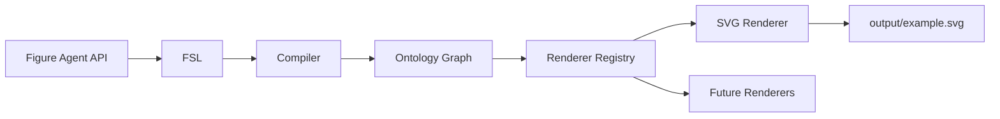

# Project Context — MedicinalChemistryFigureDesigner

Canonical context for LLMs and coding agents working in this repository.

**Version:** 0.8.0
**Repository:** https://github.com/insight2017aquib/MedicinalChemistryFigureDesigner

---

## What This Project Is

A **scientific figure platform** for medicinal chemistry and molecular biology review articles. It provides:

- Figure Specification Language (FSL) engine
- Scientific figure ontology
- FSL-to-ontology compiler
- Minimal SVG renderer
- Public Python API for any LLM or automation tool

This is **architecture and contracts**, not a content library. The repo defines structure, validation, and extension points. It does **not** contain scientific facts, biology, or journal guidelines.

---

## Hard Constraints

1. **No fabrication** — Never invent biological/chemical facts, journal rules, or worked scientific examples.
2. **User-supplied content only** — Domain knowledge lives in `knowledge/` packs (placeholders until populated).
3. **Do not redesign core layers** unless explicitly asked:
   - `src/figure_agent/fsl/`
   - `src/figure_agent/ontology/`
   - `src/figure_agent/compiler/`
   - `src/figure_agent/renderers/`
4. **Use the public API** for pipeline operations — do not bypass it with ad-hoc internal imports unless extending those layers.
5. **No scope creep** — No MCP, BioRender, GPT Image, web frameworks, or scientific illustration unless the user explicitly requests that milestone.

---

## Pipeline



End-to-end flow:

```
generate_fsl() → validate_fsl() → compile() → render() → export()
```

---

## Public API — Use This First

Import from the top-level package:

```python
from figure_agent import (
    compile,
    export,
    generate_fsl,
    health,
    render,
    render_svg,
    validate_fsl,
    version,
)
from figure_agent.api import register_renderer, GenerateFSLRequest, ContentSlotSpec
```

| Function | Purpose |
|----------|---------|
| `generate_fsl()` | Build minimal valid FSL from parameters |
| `validate_fsl(source)` | Validate dict, YAML/JSON string, or `Figure`; returns `ValidationResponse` |
| `compile(source)` | FSL → ontology graph; returns `CompileResponse` |
| `render(source, renderer="svg")` | Render FSL or graph via registered backend |
| `render_svg(source)` | Shortcut for SVG rendering |
| `export(source, path)` | Render and write to disk |
| `health()` | Service status and available renderers |
| `version()` | Package and API version metadata |
| `register_renderer(name, factory)` | Register future backends without API changes |

**Error handling:** Functions return structured responses with `valid` / `success` flags by default. Pass `raise_on_error=True` to raise `APIError` subclasses.

**Example — full pipeline:**

```python
from figure_agent import compile, export, validate_fsl, load_yaml, parse

figure = parse(load_yaml("examples/minimal_figure.yaml"))
assert validate_fsl(figure).valid

compiled = compile(figure)
assert compiled.success

export(compiled.graph, "output/example.svg")
```

Low-level modules (`compile_figure`, `FigureCompiler`, `SVGRenderer`, etc.) exist for extending internals — prefer the API for orchestration.

---

## Module Routing

| Task | Location |
|------|----------|
| LLM / agent context (this file) | `PROJECT_CONTEXT.md` |
| **Generate FSL (Claude reasoning)** | `specs/LLM_WORKFLOW.md`, `specs/ROLE_DEFINITION.md` |
| **FSL semantics and examples** | `specs/README.md`, `specs/FSL_SPEC.md`, `specs/EXAMPLES.md` |
| Auto-discovery pointer | `AGENTS.md` |
| Human overview | `README.md` |
| Architecture diagrams | `docs/Architecture.md` |
| Design constraints | `docs/DesignPrinciples.md` |
| Milestone status | `docs/DevelopmentRoadmap.md` |
| Public API details | `README.md` → Public API section |
| API implementation | `src/figure_agent/api/` |
| FSL engine | `src/figure_agent/fsl/` |
| FSL schema docs | `fsl/schema.yaml`, `fsl/validator.md` |
| FSL example | `examples/minimal_figure.yaml` |
| FSL semantics for LLMs | `specs/FSL_SPEC.md`, `specs/PROMPTING_GUIDE.md` |
| Ontology | `src/figure_agent/ontology/` |
| Compiler | `src/figure_agent/compiler/` |
| Renderers | `src/figure_agent/renderers/` |
| Render demo script | `scripts/render_example.py` |
| Claude Skill routing | `CLAUDE.md` |
| End-to-end workflow | `instructions.md` |
| Prompt templates | `prompts/` |
| Visual design system | `styles/` |
| Composition rules | `rules/` |
| Layout templates | `templates/` |
| Pre-export validation | `validation/` |
| Knowledge packs | `knowledge/` |
| Unit tests | `tests/` |

---

## Build and Test

Requires **Python 3.12+**.

```bash
pip install -e ".[dev]"
pytest
python scripts/render_example.py
```

- `pytest` — 81+ unit tests (FSL, ontology, compiler, renderer, API)
- `scripts/render_example.py` — writes `output/example.svg` via `export()`
- `output/` is gitignored

---

## Code Conventions

- **Python 3.12+**, Pydantic v2, PyYAML
- API layer uses frozen dataclasses for requests/responses
- Renderer backends inherit from `renderers.base.Renderer`
- New features need unit tests in `tests/`
- Focused diffs only — no drive-by refactors or unrelated cleanup
- Match existing naming, import style, and documentation level
- Do not add markdown files the user did not ask for

---

## Repository Layout (executable code)

```
src/figure_agent/
├── api/           # Public API (v0.7) — entry point for LLMs
├── fsl/           # FSL parser, validator, serializer (v0.3)
├── ontology/      # Entity graph, registry (v0.4)
├── compiler/      # FSL → ontology (v0.5)
├── renderers/     # SVG renderer, layout, geometry (v0.6)
└── core/          # Shared constants and types
```

---

## Milestone Status

| Version | Milestone | Status |
|---------|-----------|--------|
| v0.7 | Figure Agent API | Complete |
| v0.8 | Claude reasoning layer | **Complete** |
| v0.9 | Knowledge base | Planned |
| v1.0 | BioRender integration | Planned |
| v1.1 | Validation engine | Planned |
| v1.2 | Scientific Figure Agent | Planned |

When implementing new milestones, extend existing contracts — do not break FSL, ontology, compiler, or renderer interfaces without explicit approval.

---

## Renderer Extension Pattern

Future backends register at runtime:

```python
from figure_agent.api import register_renderer

register_renderer("biorender", BioRenderRenderer)
register_renderer("gptimage", GPTImageRenderer)

render(graph, renderer="biorender")
```

Only `svg` is implemented today. Do not implement BioRender, MCP, or image generation unless requested.

---

## What NOT To Do

- Invent scientific content or journal submission rules
- Add gradients, icons, biology assets, or BioRender to the SVG renderer
- Replace the public API with a web server or MCP server without being asked
- Duplicate this file into `README.md` — README is for humans; this file is for agents