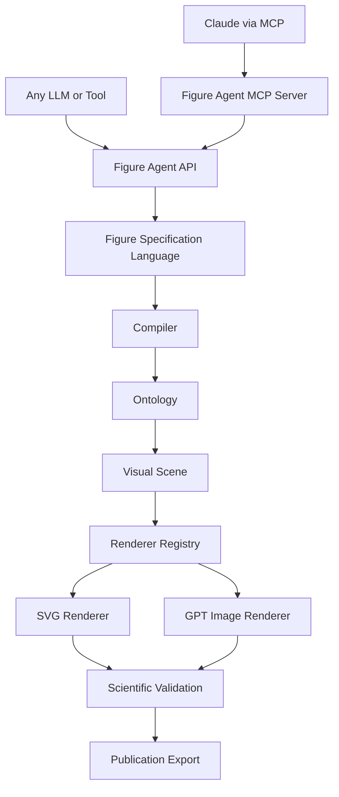
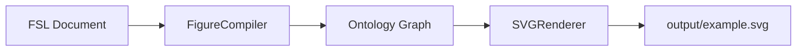

# MedicinalChemistryFigureDesigner

A modular platform for designing publication-quality scientific figures for medicinal chemistry and molecular biology review articles. Built as a Claude Skill with a staged pipeline from user brief to validated, export-ready figures.

**Current status:** v1.0 — Figure Agent MCP Server

**Repository:** [github.com/insight2017aquib/MedicinalChemistryFigureDesigner](https://github.com/insight2017aquib/MedicinalChemistryFigureDesigner)

---

## What This Project Is

MedicinalChemistryFigureDesigner is a **scientific figure platform**, not a content library. It provides:

- A **Claude Skill** entry point for interactive figure design sessions
- **Modular documentation** for styles, rules, templates, validation, and prompts
- A **Figure Specification Language (FSL)** engine (`src/figure_agent/fsl/`) for parsing, validating, and serializing figure specifications
- A **Scientific figure ontology** (`src/figure_agent/ontology/`) for typed entities and relationships
- A **Figure compiler** (`src/figure_agent/compiler/`) that transforms FSL documents into ontology graphs
- A **Minimal SVG renderer** (`src/figure_agent/renderers/`) that renders ontology graphs to SVG
- A **Public API** (`src/figure_agent/api/`) exposing the full pipeline to any LLM or automation tool
- **Knowledge packs** for domain-specific conventions (user-supplied content only)
- A **staged pipeline** toward automated rendering, validation, and export

The repository defines architecture, contracts, and extension points. It does not contain scientific facts, biology, or journal guidelines.

---

## Why It Exists

Review-article figures require consistent visual language, structural compliance, and reproducible specifications. This platform:

1. Separates **design system** (styles, rules) from **content** (user-supplied)
2. Produces **traceable specifications** (FSL) instead of ad-hoc descriptions
3. Integrates with **external tools** (BioRender, image generation) through defined interfaces
4. Enforces **validation gates** before publication export

---

## Roadmap

| Version | Milestone | Status |
|---------|-----------|--------|
| v0.1 | Repository scaffold | Complete |
| v0.2 | Platform architecture | Complete |
| v0.3 | FSL engine | Complete |
| v0.4 | Scientific figure ontology | Complete |
| v0.5 | Figure compilation engine | Complete |
| v0.6 | Minimal SVG renderer | Complete |
| v0.7 | Figure Agent API | Complete |
| v0.8 | Claude reasoning layer | Complete |
| v0.9 | Knowledge base | Planned |
| v1.0 | Figure Agent MCP Server | Complete |
| v1.1 | BioRender integration | Planned |
| v1.2 | Validation engine | Planned |
| v1.3 | Scientific Figure Agent | Planned |

See [docs/DevelopmentRoadmap.md](docs/DevelopmentRoadmap.md) for milestone details.

---

## Architecture



The **Figure Agent MCP Server** (`src/figure_agent/mcp/`) is the public interface for Claude. The **Figure Agent API** remains the stable entry point for scripts and other tools. Claude should use MCP tools — never call GPT Image APIs directly.

Full architecture with module diagrams: [docs/Architecture.md](docs/Architecture.md)

### MCP Server (v1.0)

Expose Figure Agent to Claude as MCP tools:

```bash
pip install -e ".[mcp]"
figure-agent-mcp
```

| Tool | Purpose |
|------|---------|
| `generate_fsl` | Natural language → valid FSL |
| `validate_fsl` | FSL validation report |
| `compile` | FSL → ontology graph |
| `build_scene` | FSL/graph → Visual Scene |
| `render_svg` | FSL/graph → SVG |
| `render_gpt_image` | FSL/graph → PNG (via Figure Agent) |
| `render` | Auto-select SVG or PNG |
| `health` / `version` | Server status |

Guides: [docs/MCP_QuickStart.md](docs/MCP_QuickStart.md) · [docs/Claude_MCP_Integration.md](docs/Claude_MCP_Integration.md)

---

## Repository Structure

```
MedicinalChemistryFigureDesigner/
├── README.md                  # Project overview (this file)
├── PROJECT_CONTEXT.md         # Canonical context for LLMs and coding agents
├── AGENTS.md                  # Auto-discovery pointer (Cursor, Grok, Codex, etc.)
├── specs/                     # LLM specs + Claude reasoning layer (v0.8)
├── CLAUDE.md                  # Claude Skill entry point
├── instructions.md            # End-to-end workflow
│
├── docs/                      # Platform documentation
│   ├── Architecture.md
│   ├── MCP_QuickStart.md
│   ├── Claude_MCP_Integration.md
│   ├── DevelopmentRoadmap.md
│   ├── DesignPrinciples.md
│   ├── Contributing.md
│   └── Changelog.md
│
├── src/figure_agent/          # Python package
│   ├── fsl/                   # FSL parser, validator, serializer, models
│   ├── ontology/              # Entity models, relationships, registry
│   ├── compiler/              # FSL-to-ontology compilation
│   ├── renderers/             # SVG and future renderer backends
│   ├── api/                   # Public API (service, requests, responses)
│   ├── mcp/                   # MCP server (Claude tool interface)
│   └── core/                  # Constants and shared types
│
├── scripts/                   # CLI demos
│   └── render_example.py      # FSL → SVG pipeline demo
│
├── tests/                     # Unit tests for FSL, ontology, compiler, renderer
├── pyproject.toml             # Python project configuration
│
├── fsl/                       # FSL schema documentation
│   ├── schema.yaml
│   ├── validator.md
│   └── examples/
│
├── knowledge/                 # Domain knowledge packs (placeholders)
│   ├── MedicinalChemistry/
│   ├── StructuralBiology/
│   ├── DNARepair/
│   ├── JournalStyles/
│   └── GeneralDesign/
│
├── styles/                    # Visual design system
├── rules/                     # Composition, labeling, accessibility, export
├── templates/                 # Reusable layout templates
├── validation/                # Pre-export quality gates
├── prompts/                   # Claude prompt templates per workflow stage
├── examples/                  # FSL examples and worked figure specimens
│   └── minimal_figure.yaml    # Minimal valid FSL document
│
└── .github/                   # Issue templates, PR template, workflows
```

### Core Modules (v0.1 — preserved)

| Module | Purpose |
|--------|---------|
| `styles/` | Color, typography, grids, molecular rendering, annotations |
| `rules/` | Composition, labeling, accessibility, export formats |
| `templates/` | Single/multi-panel, flow, comparison, legend layouts |
| `validation/` | Pre-export checklist, DPI, naming, metadata |
| `prompts/` | Stage-specific Claude prompt templates |
| `examples/` | Index and specimen notes for future examples |

### Platform Extensions (v0.2+)

| Module | Purpose |
|--------|---------|
| `docs/` | Architecture, roadmap, principles, contributing, changelog |
| `fsl/` | FSL schema documentation and specification skeleton |
| `knowledge/` | Placeholder packs for domain conventions |
| `.github/` | Issue templates, PR template, workflows placeholder |

### FSL Engine (v0.3 — executable)

| Component | Purpose |
|-----------|---------|
| `src/figure_agent/fsl/models.py` | Pydantic models (`Figure`, `Panel`, `Layout`, etc.) |
| `src/figure_agent/fsl/parser.py` | `load_yaml`, `load_json`, `validate_schema`, `parse` |
| `src/figure_agent/fsl/validator.py` | Semantic validation (IDs, layout, template refs) |
| `src/figure_agent/fsl/serializer.py` | YAML/JSON serialization and round-trip |

The FSL engine is a **structured representation layer** — not a rendering engine.

### Ontology Layer (v0.4 — executable)

| Component | Purpose |
|-----------|---------|
| `ontology/entities.py` | Typed entity hierarchy (`Molecule`, `Protein`, `Label`, etc.) |
| `ontology/relationships.py` | Relationship types and `OntologyGraph` container |
| `ontology/registry.py` | Entity type registration, lookup, graph serialization |
| `ontology/validator.py` | Structural validation (IDs, references, cycles) |

The ontology sits between FSL and future renderers.

### Compilation Engine (v0.5 — executable)

| Component | Purpose |
|-----------|---------|
| `compiler/compiler.py` | `FigureCompiler`, `compile_figure()` |
| `compiler/mapping.py` | FSL panels, slots, and styles → ontology entities |
| `compiler/context.py` | Compilation state, ID registry, namespacing |
| `compiler/validator.py` | Orphan detection, missing refs, graph consistency |

### SVG Renderer (v0.6 — executable)

| Component | Purpose |
|-----------|---------|
| `renderers/base.py` | Abstract `Renderer` interface |
| `renderers/svg_renderer.py` | Monochrome proof-of-concept SVG output |
| `renderers/layout.py` | Simple vertical panel layout |
| `renderers/geometry.py` | Rectangles, arrows, label placement |



Future renderers (`BioRenderRenderer`, `GPTImageRenderer`, etc.) register via `register_renderer()` and are invoked through `render(renderer="name")`.

### Figure Agent API (v0.7 — executable)

| Function | Purpose |
|----------|---------|
| `generate_fsl()` | Build a minimal valid FSL document from parameters |
| `validate_fsl()` | Validate FSL (dict, YAML/JSON string, or `Figure`) |
| `compile()` | Compile FSL into an ontology graph |
| `render_svg()` | Render to SVG (shortcut for `render(renderer="svg")`) |
| `render()` | Render via any registered backend |
| `export()` | Render and write output to disk |
| `health()` | Service health and capability check |
| `version()` | Package and API version metadata |
| `register_renderer()` | Register future renderer backends |

---

## Quick Start

Requires Python 3.12+.

```bash
pip install -e ".[dev]"
pytest
python scripts/render_example.py
```

### Python Examples

**Health check and version:**

```python
from figure_agent import health, version

print(health())   # status, components, available renderers
print(version())  # package version, API version, renderers
```

**Generate and validate FSL:**

```python
from figure_agent import generate_fsl, validate_fsl
from figure_agent.api import GenerateFSLRequest, ContentSlotSpec

generated = generate_fsl(
    GenerateFSLRequest(
        figure_id="fig-demo",
        title="Demo Figure",
        slots=(ContentSlotSpec(id="slot-1", label="Primary content"),),
    )
)
result = validate_fsl(generated.document)
assert result.valid
```

**Compile, render, and export:**

```python
from figure_agent import compile, render_svg, export, load_yaml, parse

figure = parse(load_yaml("examples/minimal_figure.yaml"))

compiled = compile(figure)
assert compiled.success

rendered = render_svg(compiled.graph)
assert rendered.success and "<svg" in rendered.content

export(compiled.graph, "output/example.svg")
```

**Pluggable renderers (future backends):**

```python
from figure_agent import render, register_renderer
from figure_agent.renderers import Renderer

# register_renderer("biorender", BioRenderRenderer)
# register_renderer("gptimage", GPTImageRenderer)

result = render(figure, renderer="svg")  # or "biorender", "pptx", etc.
```

### Low-level module access

Internal modules remain available for advanced use:

```python
from figure_agent import compile_figure, load_yaml, parse, to_yaml

figure = parse(load_yaml("examples/minimal_figure.yaml"))
graph = compile_figure(figure)
print(f"Compiled {len(graph.entities)} entities")
```

---

## Public API

Import from the top-level package or `figure_agent.api`:

```python
from figure_agent import (
    compile,
    export,
    generate_fsl,
    health,
    render,
    render_svg,
    validate_fsl,
    version,
)
```

| Function | Input | Output |
|----------|-------|--------|
| `generate_fsl(request?)` | Optional `GenerateFSLRequest` | `GenerateFSLResponse` (dict, YAML, JSON) |
| `validate_fsl(source)` | `Figure`, dict, or YAML/JSON string | `ValidationResponse` (`valid`, `errors`) |
| `compile(source)` | FSL source | `CompileResponse` (`graph`, counts) |
| `render(source, renderer="svg")` | FSL or graph, renderer name | `RenderResponse` (content, dimensions) |
| `render_svg(source)` | FSL or graph | `RenderResponse` |
| `export(source, path)` | FSL or graph, file path | `ExportResponse` |
| `health()` | — | `HealthResponse` |
| `version()` | — | `VersionResponse` |

Validation and compile/render failures return structured responses by default. Pass `raise_on_error=True` to raise `APIError` subclasses.

---

## Planned Integrations

| Integration | Milestone | Description |
|-------------|-----------|-------------|
| BioRender MCP | v0.9 | `BioRenderRenderer` via `register_renderer("biorender", ...)` |
| Advanced renderers | v0.9+ | `GPTImageRenderer`, `PowerPointRenderer`, and other `Renderer` backends |
| Validation engine | v1.0 | Automated FSL and rule compliance checking |
| Publication export | v1.1 | End-to-end packaging with metadata and format compliance |

---

## Getting Started

1. Read [instructions.md](instructions.md) for the figure design workflow
2. Review [CLAUDE.md](CLAUDE.md) for Claude Skill behavior and module routing
3. Consult [docs/DesignPrinciples.md](docs/DesignPrinciples.md) for platform constraints
4. See [docs/Contributing.md](docs/Contributing.md) before making changes

### For LLMs and coding agents

| File | Purpose |
|------|---------|
| [PROJECT_CONTEXT.md](PROJECT_CONTEXT.md) | **Primary context** — identity, constraints, public API, module routing, build commands |
| [AGENTS.md](AGENTS.md) | **Auto-discovery** — loaded by Cursor, Grok, Codex, VS Code, and other agents at session start |
| [CLAUDE.md](CLAUDE.md) | Claude Skill entry — routes to `specs/` reasoning layer |
| [specs/LLM_WORKFLOW.md](specs/LLM_WORKFLOW.md) | **FSL generation workflow** — mandatory 9-step process for Claude |

Agents should read `PROJECT_CONTEXT.md` before making changes. `AGENTS.md` points to it automatically.

Verify discovery (Grok): `grok inspect` should list `AGENTS.md` at the repo root.

---

## Contributing

Contributions welcome. Follow the standards in [docs/Contributing.md](docs/Contributing.md). Do not submit fabricated scientific content or invented journal guidelines.

Use [.github/PULL_REQUEST_TEMPLATE.md](.github/PULL_REQUEST_TEMPLATE.md) when opening pull requests.

---

## Changelog

See [docs/Changelog.md](docs/Changelog.md) for version history.