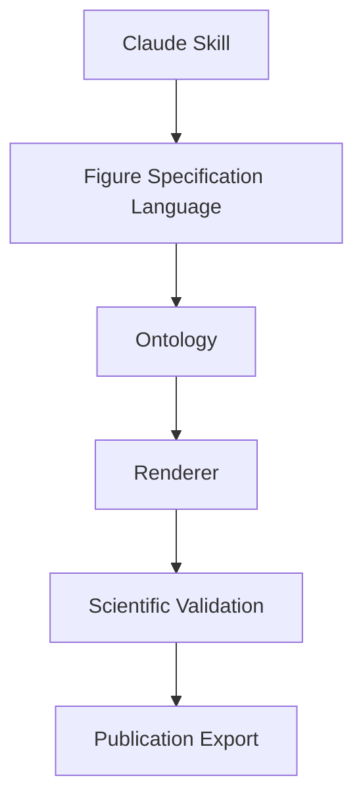
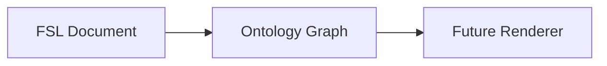

# MedicinalChemistryFigureDesigner

A modular platform for designing publication-quality scientific figures for medicinal chemistry and molecular biology review articles. Built as a Claude Skill with a staged pipeline from user brief to validated, export-ready figures.

**Current status:** v0.4 — Scientific figure ontology (FSL + ontology layers)

**Repository:** [github.com/insight2017aquib/MedicinalChemistryFigureDesigner](https://github.com/insight2017aquib/MedicinalChemistryFigureDesigner)

---

## What This Project Is

MedicinalChemistryFigureDesigner is a **scientific figure platform**, not a content library. It provides:

- A **Claude Skill** entry point for interactive figure design sessions
- **Modular documentation** for styles, rules, templates, validation, and prompts
- A **Figure Specification Language (FSL)** engine (`src/figure_agent/fsl/`) for parsing, validating, and serializing figure specifications
- A **Scientific figure ontology** (`src/figure_agent/ontology/`) for typed entities and relationships

- **Knowledge packs** for domain-specific conventions (user-supplied content only)
- A **staged pipeline** toward automated rendering, validation, and export

The repository defines architecture, contracts, and extension points. It does not contain scientific facts, biology, or journal guidelines.

---

## Why It Exists

Review-article figures require consistent visual language, structural compliance, and reproducible specifications. This platform:

1. Separates **design system** (styles, rules) from **content** (user-supplied)
2. Produces **traceable specifications** (FSL) instead of ad-hoc descriptions
3. Integrates with **external tools** (BioRender, image generation) through defined interfaces
4. Enforces **validation gates** before publication export

---

## Roadmap

| Version | Milestone | Status |
|---------|-----------|--------|
| v0.1 | Repository scaffold | Complete |
| v0.2 | Platform architecture | Complete |
| v0.3 | FSL engine | Complete |
| v0.4 | Scientific figure ontology | Complete |
| v0.5 | Figure compilation engine | Planned |
| v0.6 | Knowledge base | Planned |
| v0.7 | BioRender integration | Planned |
| v0.8 | Image generation | Planned |
| v0.9 | Validation engine | Planned |
| v1.0 | Scientific Figure Agent | Planned |

See [docs/DevelopmentRoadmap.md](docs/DevelopmentRoadmap.md) for milestone details.

---

## Architecture



Full architecture with module diagrams: [docs/Architecture.md](docs/Architecture.md)

---

## Repository Structure

```
MedicinalChemistryFigureDesigner/
├── README.md                  # Project overview (this file)
├── CLAUDE.md                  # Claude Skill entry point
├── instructions.md            # End-to-end workflow
│
├── docs/                      # Platform documentation
│   ├── Architecture.md
│   ├── DevelopmentRoadmap.md
│   ├── DesignPrinciples.md
│   ├── Contributing.md
│   └── Changelog.md
│
├── src/figure_agent/          # Python package
│   ├── fsl/                   # FSL parser, validator, serializer, models
│   ├── ontology/              # Entity models, relationships, registry
│   └── core/                  # Constants and shared types
│
├── tests/                     # Unit tests for FSL and ontology
├── pyproject.toml             # Python project configuration
│
├── fsl/                       # FSL schema documentation
│   ├── schema.yaml
│   ├── validator.md
│   └── examples/
│
├── knowledge/                 # Domain knowledge packs (placeholders)
│   ├── MedicinalChemistry/
│   ├── StructuralBiology/
│   ├── DNARepair/
│   ├── JournalStyles/
│   └── GeneralDesign/
│
├── styles/                    # Visual design system
├── rules/                     # Composition, labeling, accessibility, export
├── templates/                 # Reusable layout templates
├── validation/                # Pre-export quality gates
├── prompts/                   # Claude prompt templates per workflow stage
├── examples/                  # FSL examples and worked figure specimens
│   └── minimal_figure.yaml    # Minimal valid FSL document
│
└── .github/                   # Issue templates, PR template, workflows
```

### Core Modules (v0.1 — preserved)

| Module | Purpose |
|--------|---------|
| `styles/` | Color, typography, grids, molecular rendering, annotations |
| `rules/` | Composition, labeling, accessibility, export formats |
| `templates/` | Single/multi-panel, flow, comparison, legend layouts |
| `validation/` | Pre-export checklist, DPI, naming, metadata |
| `prompts/` | Stage-specific Claude prompt templates |
| `examples/` | Index and specimen notes for future examples |

### Platform Extensions (v0.2+)

| Module | Purpose |
|--------|---------|
| `docs/` | Architecture, roadmap, principles, contributing, changelog |
| `fsl/` | FSL schema documentation and specification skeleton |
| `knowledge/` | Placeholder packs for domain conventions |
| `.github/` | Issue templates, PR template, workflows placeholder |

### FSL Engine (v0.3 — executable)

| Component | Purpose |
|-----------|---------|
| `src/figure_agent/fsl/models.py` | Pydantic models (`Figure`, `Panel`, `Layout`, etc.) |
| `src/figure_agent/fsl/parser.py` | `load_yaml`, `load_json`, `validate_schema`, `parse` |
| `src/figure_agent/fsl/validator.py` | Semantic validation (IDs, layout, template refs) |
| `src/figure_agent/fsl/serializer.py` | YAML/JSON serialization and round-trip |

The FSL engine is a **structured representation layer** — not a rendering engine.

### Ontology Layer (v0.4 — executable)

| Component | Purpose |
|-----------|---------|
| `ontology/entities.py` | Typed entity hierarchy (`Molecule`, `Protein`, `Label`, etc.) |
| `ontology/relationships.py` | Relationship types and `OntologyGraph` container |
| `ontology/registry.py` | Entity type registration, lookup, graph serialization |
| `ontology/validator.py` | Structural validation (IDs, references, cycles) |

The ontology sits between FSL and future renderers.



---

## Python Package Quick Start

Requires Python 3.12+.

```bash
pip install -e ".[dev]"
pytest
```

```python
from figure_agent import Cell, Label, Relationship, RelationshipType, load_yaml, parse, to_yaml

figure = parse(load_yaml("examples/minimal_figure.yaml"))
print(to_yaml(figure))
```

---

## Planned Integrations

| Integration | Milestone | Description |
|-------------|-----------|-------------|
| BioRender MCP | v0.6 | Illustration assets via Model Context Protocol |
| Image generation | v0.7 | Ontology-to-render pipeline for raster and vector output |
| Validation engine | v0.8 | Automated FSL and rule compliance checking |
| Publication export | v1.0 | End-to-end packaging with metadata and format compliance |

---

## Getting Started

1. Read [instructions.md](instructions.md) for the figure design workflow
2. Review [CLAUDE.md](CLAUDE.md) for Claude Skill behavior and module routing
3. Consult [docs/DesignPrinciples.md](docs/DesignPrinciples.md) for platform constraints
4. See [docs/Contributing.md](docs/Contributing.md) before making changes

---

## Contributing

Contributions welcome. Follow the standards in [docs/Contributing.md](docs/Contributing.md). Do not submit fabricated scientific content or invented journal guidelines.

Use [.github/PULL_REQUEST_TEMPLATE.md](.github/PULL_REQUEST_TEMPLATE.md) when opening pull requests.

---

## Changelog

See [docs/Changelog.md](docs/Changelog.md) for version history.