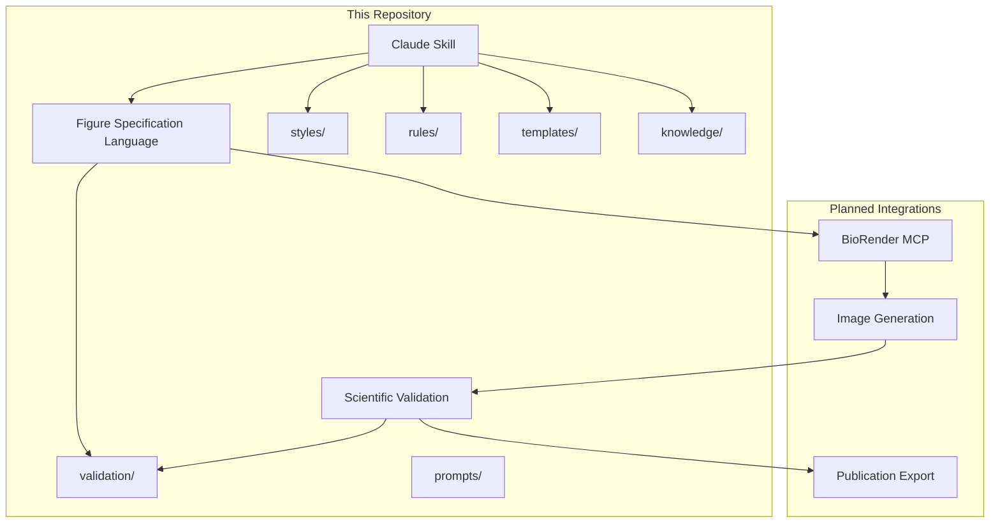
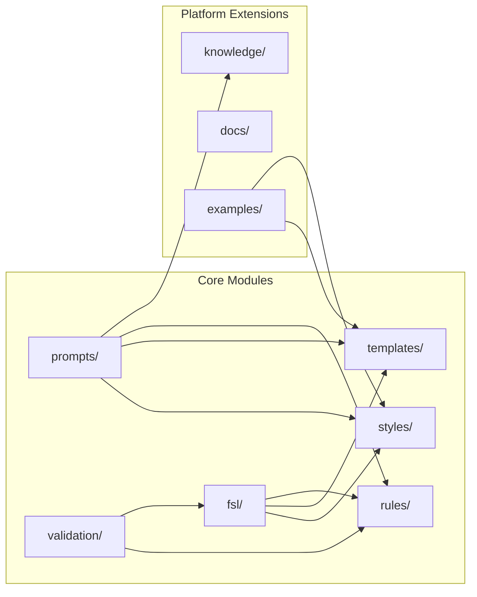
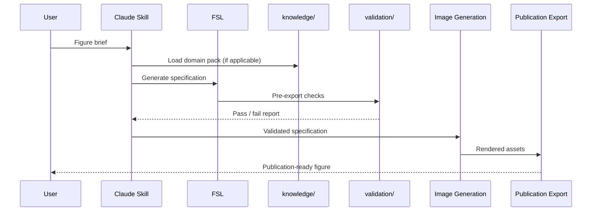

# Platform Architecture

## Purpose

Describe the end-to-end architecture of the MedicinalChemistryFigureDesigner platform: how modules connect, data flows between stages, and where extension points live.

## Scope

**In scope:**

- High-level system pipeline
- Module boundaries and responsibilities
- Integration points (Claude Skill, FSL, external tools)
- Mermaid diagrams for visual reference

**Out of scope:**

- Implementation code
- Scientific content or domain knowledge
- Journal-specific export requirements

---

## System Overview

The platform transforms a user brief into a publication-ready figure through a staged pipeline. Each stage has a dedicated module in this repository or a planned external integration.

---

## Pipeline Stages

### 1. Claude Skill

**Location:** `CLAUDE.md`, `instructions.md`, `prompts/`

The entry point for interactive figure design sessions. The skill routes user requests to the correct modules, enforces guardrails (no fabricated science), and orchestrates the workflow defined in `instructions.md`.

### 2. Figure Specification Language (FSL)

**Location:** `fsl/`

A structured description language for scientific figures. FSL captures layout, style references, content slots, and metadata in a machine-readable format. It bridges human intent and automated rendering.

### 3. BioRender MCP

**Location:** Planned external integration (v0.5)

Model Context Protocol integration with BioRender for molecular and biological illustration assets. FSL specifications will reference BioRender-compatible element slots.

### 4. Image Generation

**Location:** Planned external integration (v0.6)

Rendering pipeline that converts FSL specifications into raster or vector figure assets using styles, templates, and knowledge packs.

### 5. Scientific Validation

**Location:** `validation/`, `rules/`

Quality gates applied before export. Validates structural compliance, accessibility, naming, and metadata—not scientific accuracy (user-supplied).

### 6. Publication Export

**Location:** `validation/`, `rules/export-formats.md`

Final packaging of validated figures with metadata, correct resolution, and format per user-supplied standards.

---

## Module Dependency Diagram

---

## Data Flow

---

## Extension Points

| Extension | Location | Version Target |
|-----------|----------|----------------|
| Knowledge packs | `knowledge/` | v0.3 |
| FSL schema | `fsl/schema.yaml` | v0.4 |
| BioRender MCP | External | v0.5 |
| Image generation | External | v0.6 |
| Validation engine | `validation/` | v0.7 |
| Full agent | `CLAUDE.md` + pipeline | v1.0 |

---

## Compatibility Notes

The v0.2 platform layer (`docs/`, `knowledge/`, `fsl/`, `.github/`) extends the v0.1 scaffold without modifying existing module contracts. All original directories (`styles/`, `rules/`, `templates/`, `validation/`, `prompts/`, `examples/`) remain unchanged in purpose and structure.