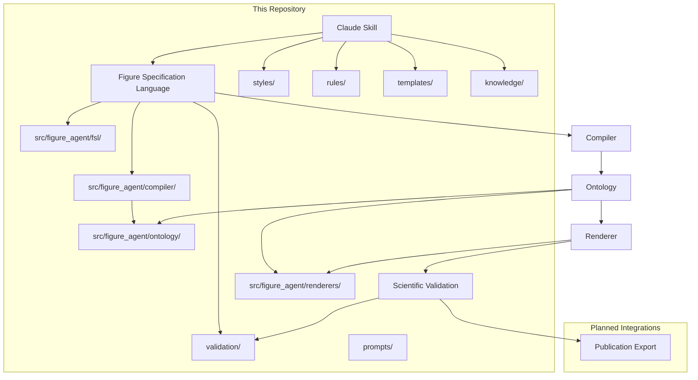
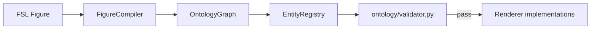
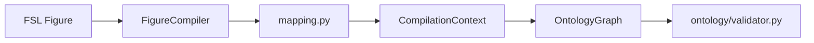
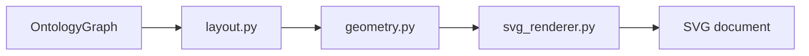
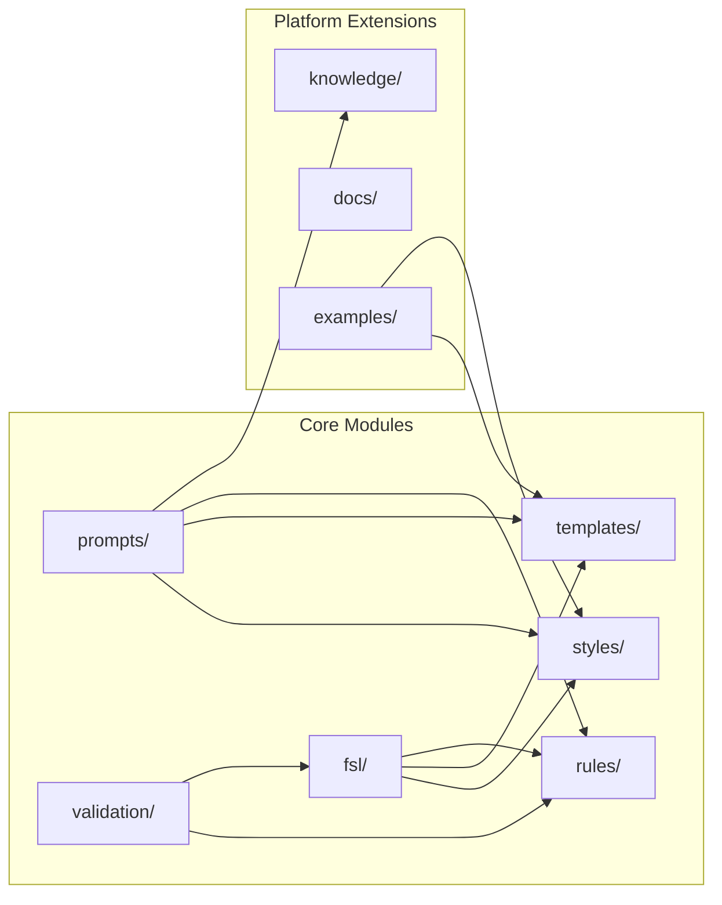
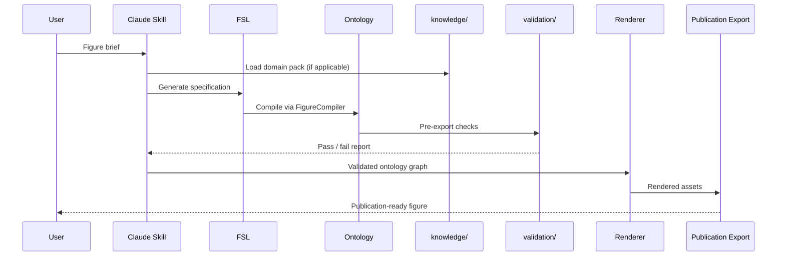

# Platform Architecture

## Purpose

Describe the end-to-end architecture of the MedicinalChemistryFigureDesigner platform: how modules connect, data flows between stages, and where extension points live.

## Scope

**In scope:**

- High-level system pipeline
- Module boundaries and responsibilities
- Integration points (Claude Skill, FSL, external tools)
- Mermaid diagrams for visual reference

**Out of scope:**

- Per-backend rendering implementation details (BioRender, image generation APIs)
- Scientific content or domain knowledge
- Journal-specific export requirements

---

## System Overview

The platform transforms a user brief into a publication-ready figure through a staged pipeline. Each stage has a dedicated module in this repository or a planned external integration.

---

## Pipeline Stages

### 1. Claude Skill

**Location:** `CLAUDE.md`, `instructions.md`, `prompts/`

The entry point for interactive figure design sessions. The skill routes user requests to the correct modules, enforces guardrails (no fabricated science), and orchestrates the workflow defined in `instructions.md`.

### 2. Figure Specification Language (FSL)

**Documentation:** `fsl/` (schema skeleton, validator spec)

**Implementation:** `src/figure_agent/fsl/` (v0.3 engine)

A structured description language for scientific figures. FSL captures layout, style references, content slots, and metadata in a machine-readable format. It bridges human intent and automated rendering.

The v0.3 FSL engine provides:

| Module | Responsibility |
|--------|----------------|
| `models.py` | Pydantic models (`Figure`, `Metadata`, `Panel`, `Layout`, etc.) |
| `parser.py` | Load YAML/JSON, schema validation, full parse pipeline |
| `validator.py` | Semantic checks: duplicate IDs, layout consistency, template refs |
| `serializer.py` | Serialize to YAML/JSON with round-trip consistency |

### 3. Scientific Figure Ontology

**Implementation:** `src/figure_agent/ontology/` (v0.4)

Typed representation of figure components and their relationships. The ontology layer translates FSL content slots into structured entity graphs that future renderers consume.

| Module | Responsibility |
|--------|----------------|
| `entities.py` | Entity hierarchy (`Molecule`, `Protein`, `Label`, `Arrow`, etc.) |
| `relationships.py` | Relationship types (`contains`, `annotates`, etc.) and `OntologyGraph` |
| `registry.py` | Entity type registration, instance lookup, graph serialization |
| `validator.py` | Structural checks: duplicate IDs, missing refs, cycles |
| `enums.py` | `EntityType` and `RelationshipType` identifiers |

The ontology defines **structure only** — no biological semantics, no rendering, no scientific validation.

### 4. Figure Compilation Engine

**Implementation:** `src/figure_agent/compiler/` (v0.5)

Transforms validated FSL `Figure` documents into `OntologyGraph` instances. Bridges the specification layer and the typed entity layer.

| Module | Responsibility |
|--------|----------------|
| `compiler.py` | `FigureCompiler`, orchestrates compilation pipeline |
| `mapping.py` | Maps panels, content slots, and style refs to ontology entities |
| `context.py` | Tracks compilation state, qualified object registry, ID namespacing |
| `validator.py` | Detects orphan slots, missing references, invalid mappings |

### 5. Renderer

**Implementation:** `src/figure_agent/renderers/` (v0.6)

Converts compiled `OntologyGraph` instances into graphical output. All renderer backends share a common abstract interface so the pipeline remains backend-agnostic.

| Module | Responsibility |
|--------|----------------|
| `base.py` | Abstract `Renderer`, `RenderConfig`, `RenderResult` |
| `svg_renderer.py` | `SVGRenderer` — proof-of-concept monochrome SVG output |
| `layout.py` | Simple automatic layout (vertical stacking, panel arrangement) |
| `geometry.py` | Rectangles, arrows, centered label placement |
| `styling.py` | Monochrome palette constants |
| `exceptions.py` | `RenderError`, `LayoutError`, `SVGRenderError` |

**v0.6 rendering scope** (intentionally minimal):

- Rectangle and rounded rectangle
- Text label (centered)
- Straight arrow
- Container box and panel boundary

No gradients, shadows, icons, or scientific illustration assets.

**Future renderer implementations** (inherit from `Renderer`):

| Renderer | Target | Milestone |
|----------|--------|-----------|
| `BioRenderRenderer` | BioRender MCP assets | v0.8 |
| `GPTImageRenderer` | Image generation API | v0.9+ |
| `PowerPointRenderer` | Slide export | Future |
| `MermaidRenderer` | Diagram syntax | Future |
| `IllustratorRenderer` | Vector authoring tools | Future |

Demo: `python scripts/render_example.py` writes `output/example.svg`.

### 6. Scientific Validation

**Location:** `validation/`, `rules/`

Quality gates applied before export. Validates structural compliance, accessibility, naming, and metadata—not scientific accuracy (user-supplied).

### 7. Publication Export

**Location:** `validation/`, `rules/export-formats.md`

Final packaging of validated figures with metadata, correct resolution, and format per user-supplied standards.

---

## Module Dependency Diagram

---

## Data Flow

---

## Extension Points

| Extension | Location | Version Target |
|-----------|----------|----------------|
| FSL engine | `src/figure_agent/fsl/` | v0.3 |
| Figure ontology | `src/figure_agent/ontology/` | v0.4 |
| Figure compiler | `src/figure_agent/compiler/` | v0.5 |
| SVG renderer | `src/figure_agent/renderers/` | v0.6 |
| Knowledge packs | `knowledge/` | v0.7 |
| FSL schema (complete) | `fsl/schema.yaml` | v0.7 |
| BioRender MCP renderer | External | v0.8 |
| Advanced renderers (image gen, export) | `src/figure_agent/renderers/` | v0.9+ |
| Validation engine | `validation/` + engine | v0.9 |
| Full agent | `CLAUDE.md` + pipeline | v1.0 |

---

## Compatibility Notes

The v0.2 platform layer (`docs/`, `knowledge/`, `fsl/`, `.github/`) extends the v0.1 scaffold without modifying existing module contracts. All original directories (`styles/`, `rules/`, `templates/`, `validation/`, `prompts/`, `examples/`) remain unchanged in purpose and structure.