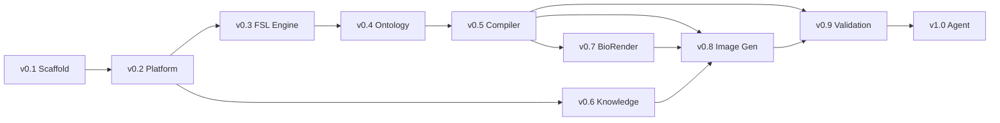

# Development Roadmap

## Purpose

Track planned milestones from repository scaffold through full Scientific Figure Agent capability.

## Scope

**In scope:**

- Version milestones and deliverables
- Dependency ordering between milestones
- Status tracking placeholders

**Out of scope:**

- Sprint planning or dates
- Scientific feature specifications
- Third-party vendor commitments

---

## Milestones

| Version | Name | Status | Summary |
|---------|------|--------|---------|
| v0.1 | Repository scaffold | Complete | Modular folder structure, placeholder Markdown modules |
| v0.2 | Platform architecture | Complete | `docs/`, `knowledge/`, `fsl/`, `.github/` platform layer |
| v0.3 | FSL engine | Complete | Python package: parse, validate, serialize figure specifications |
| v0.4 | Scientific figure ontology | Complete | Typed entities, relationships, registry, structural validation |
| v0.5 | Figure compilation engine | Planned | FSL → ontology graph transformation |
| v0.6 | Knowledge base | Planned | Populated knowledge packs with user-supplied domain content |
| v0.7 | BioRender integration | Planned | MCP connector for illustration asset references |
| v0.8 | Image generation | Planned | Ontology-to-render pipeline for figure assets |
| v0.9 | Validation engine | Planned | Automated validation against rules and FSL schema |
| v1.0 | Scientific Figure Agent | Planned | End-to-end agent with full pipeline integration |

---

## Milestone Details

### v0.1 — Repository Scaffold (Complete)

- [x] Core module directories
- [x] Entry points and placeholder documentation
- [x] GitHub repository initialized

### v0.2 — Platform Architecture (Complete)

- [x] `docs/`, `knowledge/`, `fsl/`, `.github/`

### v0.3 — FSL Engine (Complete)

- [x] `src/figure_agent/fsl/` — parser, validator, serializer, models
- [x] Unit tests and `examples/minimal_figure.yaml`

### v0.4 — Scientific Figure Ontology (Complete)

- [x] `src/figure_agent/ontology/` — entities, relationships, registry, validator
- [x] Ontology serialization and unit tests

### v0.5 — Figure Compilation Engine (Planned)

- [ ] `src/figure_agent/compiler/` — compiler, mapping, context, validator
- [ ] FSL-to-ontology mapping layer
- [ ] Unit tests for compilation pipeline

### v0.6 — Knowledge Base (Planned)

- [ ] Knowledge pack schema and metadata format
- [ ] User-supplied content ingestion guidelines
- [ ] Integration hooks in `prompts/` and `fsl/`

### v0.7 — BioRender Integration (Planned)

- [ ] MCP server configuration
- [ ] Asset reference mapping in ontology entities

### v0.8 — Image Generation (Planned)

- [ ] Rendering backend selection
- [ ] Ontology-to-render pipeline

### v0.9 — Validation Engine (Planned)

- [ ] Automated checklist runner
- [ ] Extended FSL and rule compliance reporting

### v1.0 — Scientific Figure Agent (Planned)

- [ ] Full pipeline orchestration in Claude Skill
- [ ] End-to-end session workflow

---

## Dependency Graph

