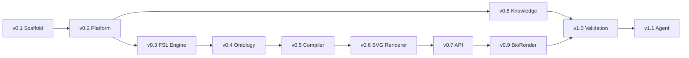

# Development Roadmap

## Purpose

Track planned milestones from repository scaffold through full Scientific Figure Agent capability.

## Scope

**In scope:**

- Version milestones and deliverables
- Dependency ordering between milestones
- Status tracking placeholders

**Out of scope:**

- Sprint planning or dates
- Scientific feature specifications
- Third-party vendor commitments

---

## Milestones

| Version | Name | Status | Summary |
|---------|------|--------|---------|
| v0.1 | Repository scaffold | Complete | Modular folder structure, placeholder Markdown modules |
| v0.2 | Platform architecture | Complete | `docs/`, `knowledge/`, `fsl/`, `.github/` platform layer |
| v0.3 | FSL engine | Complete | Python package: parse, validate, serialize figure specifications |
| v0.4 | Scientific figure ontology | Complete | Typed entities, relationships, registry, structural validation |
| v0.5 | Figure compilation engine | Complete | FSL → ontology graph transformation |
| v0.6 | Minimal SVG renderer | Complete | Ontology graph → monochrome SVG proof-of-concept |
| v0.7 | Figure Agent API | Complete | Stable public API for LLMs and automation tools |
| v0.8 | Knowledge base | Planned | Populated knowledge packs with user-supplied domain content |
| v0.9 | BioRender integration | Planned | MCP connector and `BioRenderRenderer` backend |
| v1.0 | Validation engine | Planned | Automated validation against rules and FSL schema |
| v1.1 | Scientific Figure Agent | Planned | End-to-end agent with full pipeline integration |

---

## Milestone Details

### v0.1 — Repository Scaffold (Complete)

- [x] Core module directories
- [x] Entry points and placeholder documentation
- [x] GitHub repository initialized

### v0.2 — Platform Architecture (Complete)

- [x] `docs/`, `knowledge/`, `fsl/`, `.github/`

### v0.3 — FSL Engine (Complete)

- [x] `src/figure_agent/fsl/` — parser, validator, serializer, models
- [x] Unit tests and `examples/minimal_figure.yaml`

### v0.4 — Scientific Figure Ontology (Complete)

- [x] `src/figure_agent/ontology/` — entities, relationships, registry, validator
- [x] Ontology serialization and unit tests

### v0.5 — Figure Compilation Engine (Complete)

- [x] `src/figure_agent/compiler/` — compiler, mapping, context, validator
- [x] FSL panels, slots, styles → ontology entities
- [x] Namespaced ID assignment and qualified object registry
- [x] Orphan slot and missing reference detection
- [x] Unit tests: simple/multi-panel compile, layout mapping, graph consistency

### v0.6 — Minimal SVG Renderer (Complete)

- [x] `src/figure_agent/renderers/` — abstract `Renderer`, `SVGRenderer`, layout, geometry, styling
- [x] Simple vertical panel layout with constant spacing and centered labels
- [x] Monochrome SVG output: rectangles, rounded rects, labels, straight arrows, panel boundaries
- [x] Unit tests: SVG generation, geometry, label/arrow placement, empty and multi-panel graphs
- [x] `scripts/render_example.py` — FSL → compile → render → `output/example.svg`

### v0.7 — Figure Agent API (Complete)

- [x] `src/figure_agent/api/` — service, requests, responses, exceptions
- [x] Public functions: `generate_fsl`, `validate_fsl`, `compile`, `render`, `render_svg`, `export`, `health`, `version`
- [x] Pluggable renderer registry via `register_renderer()`
- [x] Unit tests: valid/invalid FSL, compile, render, export, error handling

### v0.8 — Knowledge Base (Planned)

- [ ] Knowledge pack schema and metadata format
- [ ] User-supplied content ingestion guidelines
- [ ] Integration hooks in `prompts/` and `fsl/`

### v0.9 — BioRender Integration (Planned)

- [ ] MCP server configuration
- [ ] `BioRenderRenderer` registered via `register_renderer("biorender", ...)`
- [ ] Asset reference mapping in ontology entities

### v1.0 — Validation Engine (Planned)

- [ ] Automated checklist runner
- [ ] Extended FSL and rule compliance reporting

### v1.1 — Scientific Figure Agent (Planned)

- [ ] Full pipeline orchestration via public API
- [ ] End-to-end session workflow (brief → FSL → ontology → render → validate → export)

---

## Dependency Graph



---

## Pipeline (v0.7)

The public API exposes the full architecture from specification to graphical output:

```
generate_fsl() → validate_fsl() → compile() → render() → export()
     FSL              FSL         Ontology    SVG/etc.    file
```

Future renderer backends register via `register_renderer()` and are invoked with `render(renderer="biorender")` without changing the API surface.