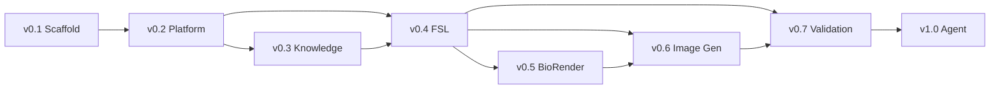

# Development Roadmap

## Purpose

Track planned milestones from repository scaffold through full Scientific Figure Agent capability.

## Scope

**In scope:**

- Version milestones and deliverables
- Dependency ordering between milestones
- Status tracking placeholders

**Out of scope:**

- Sprint planning or dates
- Scientific feature specifications
- Third-party vendor commitments

---

## Milestones

| Version | Name | Status | Summary |
|---------|------|--------|---------|
| v0.1 | Repository scaffold | Complete | Modular folder structure, placeholder Markdown modules |
| v0.2 | Platform architecture | In progress | `docs/`, `knowledge/`, `fsl/`, `.github/` platform layer |
| v0.3 | Knowledge base | Planned | Populated knowledge packs with user-supplied domain content |
| v0.4 | Figure Specification Language | Planned | FSL schema, validator, and worked examples |
| v0.5 | BioRender integration | Planned | MCP connector for BioRender asset references |
| v0.6 | Image generation | Planned | Rendering pipeline from FSL to figure assets |
| v0.7 | Validation engine | Planned | Automated validation against rules and FSL schema |
| v1.0 | Scientific Figure Agent | Planned | End-to-end agent with full pipeline integration |

---

## Milestone Details

### v0.1 — Repository Scaffold (Complete)

- [x] Core module directories (`styles/`, `rules/`, `templates/`, `validation/`, `prompts/`, `examples/`)
- [x] Entry points (`README.md`, `CLAUDE.md`, `instructions.md`)
- [x] Placeholder documentation per module
- [x] GitHub repository initialized

### v0.2 — Platform Architecture (In Progress)

- [x] `docs/` project documentation
- [x] `knowledge/` placeholder knowledge packs
- [x] `fsl/` skeleton specification language
- [x] `.github/` issue and PR templates
- [ ] Cross-module index in root `README.md`
- [ ] Changelog entry for v0.2

### v0.3 — Knowledge Base (Planned)

- [ ] Knowledge pack schema and metadata format
- [ ] User-supplied content ingestion guidelines
- [ ] Pack versioning and attribution requirements
- [ ] Integration hooks in `prompts/` and `fsl/`

### v0.4 — Figure Specification Language (Planned)

- [ ] Complete `fsl/schema.yaml`
- [ ] FSL validator implementation
- [ ] Example specifications in `fsl/examples/`
- [ ] FSL reference documentation

### v0.5 — BioRender Integration (Planned)

- [ ] MCP server configuration
- [ ] Asset reference mapping in FSL
- [ ] Integration tests (placeholder)

### v0.6 — Image Generation (Planned)

- [ ] Rendering backend selection
- [ ] FSL-to-render pipeline
- [ ] Export format support per `rules/export-formats.md`

### v0.7 — Validation Engine (Planned)

- [ ] Automated checklist runner
- [ ] FSL schema validation
- [ ] Rule compliance reporting

### v1.0 — Scientific Figure Agent (Planned)

- [ ] Full pipeline orchestration in Claude Skill
- [ ] End-to-end session workflow
- [ ] Production documentation and examples

---

## Dependency Graph

