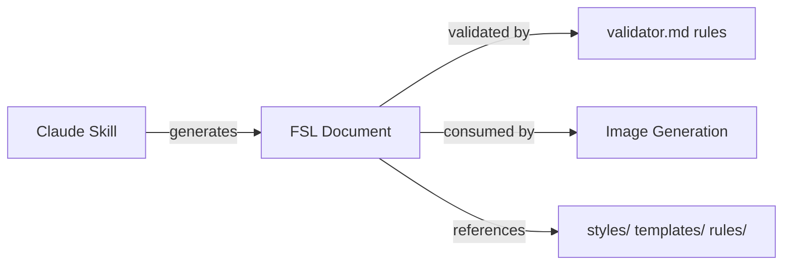

# Figure Specification Language (FSL)

## Purpose

Define FSL as the structured description language for scientific figures in this platform. FSL bridges user intent (via the Claude Skill) and automated rendering (via planned image generation integrations).

## Scope

**In scope:**

- FSL concept and role in the pipeline
- Skeleton schema in `schema.yaml`
- Validator specification in `validator.md`
- Example specification placeholders in `examples/`
- Versioning and extension strategy

**Out of scope:**

- Complete schema design (v0.4 milestone)
- Rendering implementation
- Scientific content within specifications

---

## What is FSL?

FSL is a machine-readable format that describes:

- **Figure metadata** — title, version, provenance
- **Layout** — template reference, panel structure, zones
- **Style bindings** — references to `styles/` tokens
- **Content slots** — labeled placeholders for user-supplied content
- **Validation hints** — rule and checklist references

FSL does not contain rendered images. It is a specification that downstream tools consume.

---

## Pipeline Position

---

## File Index

| File | Purpose | Status |
|------|---------|--------|
| `schema.yaml` | FSL document structure skeleton | Placeholder |
| `validator.md` | Validation rules for FSL documents | Placeholder |
| `examples/` | Example FSL documents | Placeholder |

---

## Sections to be Completed

- [ ] Complete schema definition (v0.4)
- [ ] Validator implementation specification
- [ ] Example documents for each template type
- [ ] FSL versioning and migration policy
- [ ] Integration guide for image generation backends

## TODO

- [ ] Finalize top-level schema fields in `schema.yaml`
- [ ] Define relationship between FSL and `templates/` slot names
- [ ] Document FSL output format from `prompts/layout-generation.md`
- [ ] Add schema validation tooling in v0.7