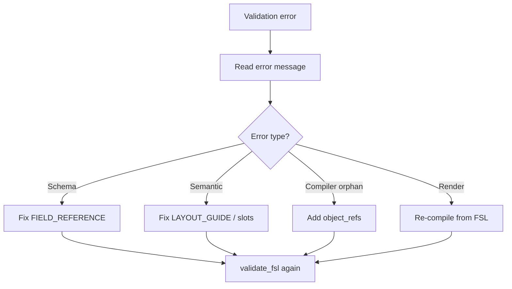

# Common Errors

Mistakes LLMs make when generating FSL, with corrections.

**See also:** [VALIDATION_RULES.md](./VALIDATION_RULES.md), [FIGURE_GRAMMAR.md](./FIGURE_GRAMMAR.md), [FIELD_REFERENCE.md](./FIELD_REFERENCE.md)

---

## Using Ontology Entities Inside FSL

### Mistake

```yaml
content_slots:
  - id: "fig-001:slot:slot-1"
    type: "Label"
```

### Why wrong

Namespaced ontology IDs and entity type names are **compiler output**, not FSL input.

### Correction

```yaml
content_slots:
  - id: "slot-1"
    type: "placeholder"
    label: "Primary content"
```

---

## Creating Relationships Inside FSL

### Mistake

```yaml
relationships:
  - type: contains
    source: panel-a
    target: slot-1
```

### Why wrong

FSL has no relationship syntax. The compiler generates `contains` and `references`.

### Correction

Remove `relationships`. Use `layout.panels[].object_refs` to assign slots to panels.

---

## Missing IDs

### Mistake

```yaml
metadata:
  title: "Untitled"
# missing metadata.id
```

### Why wrong

Schema validation requires `metadata.id`.

### Error

`metadata.id: Field required`

### Correction

```yaml
metadata:
  id: "fig-001"
  title: "Untitled"
```

---

## Duplicate IDs

### Mistake — duplicate panel IDs

```yaml
layout:
  panels:
    - id: "panel-a"
      object_refs: []
    - id: "panel-a"
      object_refs: []
```

### Error

`duplicate panel id 'panel-a'`

### Correction

Use unique panel IDs: `panel-a`, `panel-b`.

### Mistake — duplicate slot IDs

```yaml
content_slots:
  - id: "slot-1"
    type: "placeholder"
  - id: "slot-1"
    type: "shape"
```

### Error

`duplicate content slot id 'slot-1'`

### Correction

Assign unique slot IDs.

---

## Missing Content Slots

### Mistake

```yaml
layout:
  panels:
    - id: "panel-a"
      object_refs: ["slot-1"]
content_slots: []
```

### Error

`panel 'panel-a' references unknown object 'slot-1'`

### Correction

```yaml
content_slots:
  - id: "slot-1"
    label: "Primary content"
    type: "placeholder"
```

---

## Orphan Content Slots

### Mistake

```yaml
content_slots:
  - id: "slot-1"
    type: "placeholder"
  - id: "slot-2"
    type: "placeholder"
layout:
  panels:
    - id: "panel-a"
      object_refs: ["slot-1"]
```

### Error

`content slot 'slot-2' is orphaned (not referenced by any panel)`

### Correction

Add `slot-2` to a panel's `object_refs` or remove the slot.

---

## Unknown Layout Type

### Mistake

```yaml
layout:
  type: "grid"
```

### Error

`layout.type 'grid' is unknown; expected one of: comparison-layout, multi-panel, schematic-flow, single-panel`

### Correction

Use a supported type from [LAYOUT_GUIDE.md](./LAYOUT_GUIDE.md). For grid-like intent, use `multi-panel`.

---

## Wrong Panel Count

### Mistake — too many panels for single-panel

```yaml
layout:
  type: "single-panel"
  panels:
    - id: "panel-a"
      object_refs: ["slot-1"]
    - id: "panel-b"
      object_refs: ["slot-2"]
```

### Error

`layout.type 'single-panel' allows at most 1 panel(s), found 2`

### Correction

Change to `multi-panel` or remove extra panels.

### Mistake — too few panels for multi-panel

```yaml
layout:
  type: "multi-panel"
  panels:
    - id: "panel-a"
      object_refs: ["slot-1"]
```

### Error

`layout.type 'multi-panel' requires at least 2 panel(s), found 1`

### Correction

Add a second panel or use `single-panel`.

---

## Unknown Template

### Mistake

```yaml
template:
  ref: "templates/custom-layout.md"
```

### Error

`template.ref 'templates/custom-layout.md' is unknown`

### Correction

Use a known template:

- `templates/single-panel.md`
- `templates/multi-panel.md`
- `templates/schematic-flow.md`
- `templates/comparison-layout.md`
- `templates/legend-block.md`

---

## Unknown Styles (Convention)

### Mistake

```yaml
styles:
  refs:
    - ref: "styles/nature-cell-press.md"
```

### Why wrong

File does not exist. FSL semantic validator does not catch this today, but the path is invalid.

### Correction

```yaml
styles:
  refs:
    - ref: "styles/color-system.md"
```

See [STYLING_GUIDE.md](./STYLING_GUIDE.md) for valid paths.

---

## Slots Defined Inside Panels

### Mistake

```yaml
layout:
  panels:
    - id: "panel-a"
      slots:
        - id: "slot-1"
          label: "Content"
```

### Why wrong

Slots must be defined in `content_slots[]`, not nested under panels.

### Correction

```yaml
layout:
  panels:
    - id: "panel-a"
      object_refs: ["slot-1"]
content_slots:
  - id: "slot-1"
    label: "Content"
    type: "placeholder"
```

---

## Referencing Panel IDs in object_refs

### Mistake

```yaml
layout:
  panels:
    - id: "panel-a"
      object_refs: ["panel-b"]
```

### Why wrong

`object_refs` must list **slot** IDs, not panel IDs.

### Correction

Reference `content_slots[].id` values only.

---

## Unsupported fsl_version

### Mistake

```yaml
fsl_version: "1.0.0"
```

### Error

`fsl_version '1.0.0' is unsupported; expected one of: 0.2.0-draft, 0.3.0`

### Correction

```yaml
fsl_version: "0.3.0"
```

---

## Extra Unknown Fields

### Mistake

```yaml
figure_name: "My Figure"
metadata:
  id: "fig-001"
  title: "Test"
```

### Error

`Extra inputs are not permitted`

### Correction

Remove keys not in the `Figure` model. Use `metadata.title` for the figure name.

---

## Invented Biology or Journal Content

### Mistake

```yaml
content_slots:
  - id: "slot-kinase"
    label: "EGFR phosphorylates downstream MAPK"
    type: "protein"
    value: { sequence: "MKT..." }
```

### Why wrong

Unless user-supplied, scientific claims and data must not be fabricated.

### Correction

```yaml
content_slots:
  - id: "slot-1"
    label: "User-supplied mechanism step"
    type: "placeholder"
    value: null
```

---

## Error Recovery Workflow



---

## Related

- [VALIDATION_RULES.md](./VALIDATION_RULES.md) — which stage emits each error
- [EXAMPLES.md](./EXAMPLES.md) — valid patterns
- [PROMPTING_GUIDE.md](./PROMPTING_GUIDE.md) — prevent errors upstream