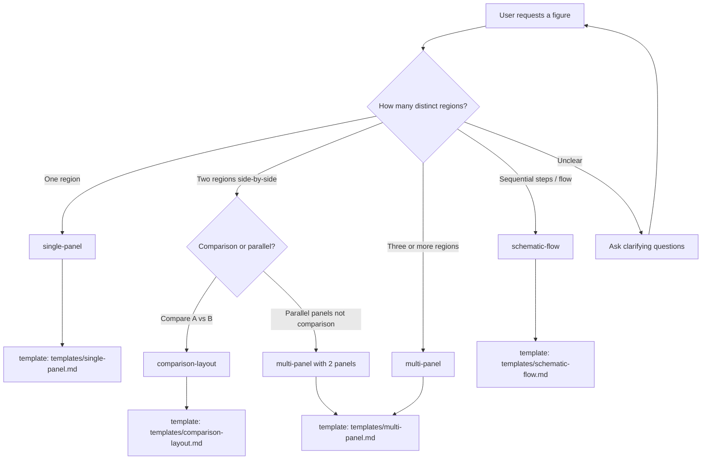

# Decision Tree

Layout and template decisions to minimize FSL hallucinations.

**See also:** [LAYOUT_GUIDE.md](./LAYOUT_GUIDE.md), [LLM_WORKFLOW.md](./LLM_WORKFLOW.md), [EXAMPLES.md](./EXAMPLES.md)

**Source:** `KNOWN_LAYOUT_TYPES`, `KNOWN_TEMPLATES`, `LAYOUT_PANEL_RULES` in `src/figure_agent/core/constants.py`

---

## Primary Decision Tree

---

## Figure Type → layout.type

| User intent | `layout.type` | Panel count |
|-------------|---------------|-------------|
| Single illustration, one canvas | `single-panel` | 1 |
| Two panels, side-by-side (general) | `multi-panel` | 2 |
| Three+ panels | `multi-panel` | 3+ |
| Compare condition A vs B | `comparison-layout` | 2+ |
| Workflow, pathway, steps | `schematic-flow` | 1+ |
| Legend only (with figure) | Any + `templates/legend-block.md` for legend template ref when appropriate | varies |

---

## Unsupported Requests

| User asks for | Response |
|---------------|----------|
| Grid layout | Explain `grid` is not in `KNOWN_LAYOUT_TYPES`. Offer `multi-panel`. See [LAYOUT_GUIDE.md](./LAYOUT_GUIDE.md). |
| Free positioning | Explain FSL has no coordinates. Offer `multi-panel` with zones. |
| "Two panel" as layout type | Use `multi-panel` or `comparison-layout` — there is no `two-panel` type. |
| BioRender illustration | Decline — not implemented. Use `placeholder` or `image` slots. |
| Embedded SVG | Decline — output FSL only per [OUTPUT_CONTRACT.md](./OUTPUT_CONTRACT.md). |

---

## Template Selection

After choosing `layout.type`, set `template.ref`:

| layout.type | template.ref |
|-------------|--------------|
| `single-panel` | `templates/single-panel.md` |
| `multi-panel` | `templates/multi-panel.md` |
| `schematic-flow` | `templates/schematic-flow.md` |
| `comparison-layout` | `templates/comparison-layout.md` |

**Legend block:** `templates/legend-block.md` is valid for any layout when user needs a legend region — does not replace `layout.type`.

**Unknown template:** Validation fails. Full list in [FIELD_REFERENCE.md](./FIELD_REFERENCE.md) → `template.ref`.

---

## Slot Type Decision

| Content need | `content_slots[].type` |
|--------------|------------------------|
| Text label / placeholder | `placeholder` or `label` |
| Generic box / structure | `shape` |
| Connection between steps | `arrow` |
| Callout / note | `annotation` |
| User-supplied image path | `image` |
| Unknown | `placeholder` (safest) |

Full mapping: [FIGURE_GRAMMAR.md](./FIGURE_GRAMMAR.md) — Content Slot Type Grammar

---

## When to Ask Clarifying Questions

Ask when **any** of these are unknown:

- Number of panels/regions
- Whether layout is comparison vs parallel vs flow
- Labels for content slots (user must supply or approve placeholders)
- Export format preference (`svg`, `png`)

**Do not ask** for scientific data Claude would fabricate (IC50, sequences, mechanisms).

**Recovery:** [FAILURE_RECOVERY.md](./FAILURE_RECOVERY.md)

---

## Quick Reference Examples

| Decision path | Example document |
|---------------|------------------|
| Single panel | [EXAMPLES.md](./EXAMPLES.md) Example 1 |
| Two panel | Example 2 |
| Three panel | Example 3 |
| Workflow | Example 4 |
| Comparison | Example 5 |

---

## Related

- [../PROJECT_CONTEXT.md](../PROJECT_CONTEXT.md)
- [../README.md](../README.md)
- [FSL_SPEC.md](./FSL_SPEC.md)
- [LLM_WORKFLOW.md](./LLM_WORKFLOW.md)