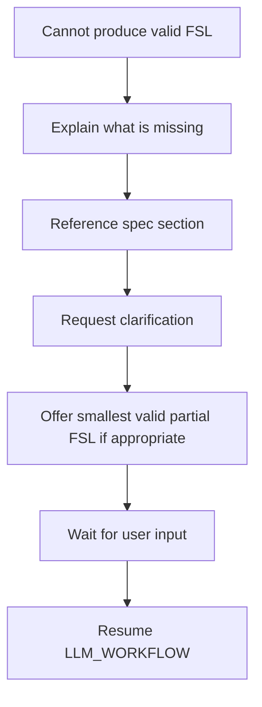

# Failure Recovery

What Claude does when valid FSL cannot be produced.

**See also:** [LLM_WORKFLOW.md](./LLM_WORKFLOW.md), [SELF_VALIDATION.md](./SELF_VALIDATION.md), [DECISION_TREE.md](./DECISION_TREE.md)

---

## Core Rule

**Do NOT guess.**

When requirements are insufficient or contradictory, do not fabricate FSL syntax, layout types, scientific content, or template paths.

---

## Recovery Procedure



---

## Step 1: Explain What Is Missing

State clearly and specifically:

| Gap type | Example message |
|----------|-----------------|
| Unknown panel count | "I need to know how many panels: one, two, or more?" |
| Unknown layout intent | "Is this a comparison (A vs B) or a workflow (steps)?" |
| Missing slot labels | "What labels should appear in each region? I can use placeholders until you provide text." |
| Unsupported feature | "`grid` layout is not supported. I can use `multi-panel` with {N} panels instead." |
| Missing scientific content | "I cannot invent mechanism details. Please supply labels or approve neutral placeholders." |

---

## Step 2: Request Clarification

Ask the **minimum** questions needed per [DECISION_TREE.md](./DECISION_TREE.md):

1. Panel count / layout intent
2. Slot labels (user-supplied)
3. Export format (if relevant)

Do not ask for data Claude would fabricate.

---

## Step 3: Reference Specification

Point to the relevant document:

| Issue | Reference |
|-------|-----------|
| Layout choice | [LAYOUT_GUIDE.md](./LAYOUT_GUIDE.md), [DECISION_TREE.md](./DECISION_TREE.md) |
| Invalid field | [FIELD_REFERENCE.md](./FIELD_REFERENCE.md) |
| Grammar error | [FIGURE_GRAMMAR.md](./FIGURE_GRAMMAR.md) |
| Validation failure | [VALIDATION_RULES.md](./VALIDATION_RULES.md), [COMMON_ERRORS.md](./COMMON_ERRORS.md) |
| Example pattern | [EXAMPLES.md](./EXAMPLES.md) |

---

## Step 4: Smallest Valid Partial FSL

When appropriate, offer a **minimal valid baseline** the user can extend:

**Use when:**

- User wants a starting point while deciding content
- Only non-critical fields are missing (e.g. captions, optional styles)

**Pattern:** [EXAMPLES.md](./EXAMPLES.md) Example 1 — single panel, one placeholder slot.

```yaml
fsl_version: "0.3.0"
metadata:
  id: "fig-draft"
  title: "Draft — awaiting user content"
template:
  ref: "templates/single-panel.md"
  params: {}
layout:
  type: "single-panel"
  panels:
    - id: "panel-a"
      zones: ["primary"]
      object_refs: ["slot-1"]
content_slots:
  - id: "slot-1"
    label: "User-supplied content"
    type: "placeholder"
    value: null
styles:
  refs:
    - ref: "styles/color-system.md"
  overrides: {}
rules:
  refs: []
validation:
  refs: []
  required_checks: []
knowledge:
  packs: []
integrations: {}
export:
  formats: ["svg"]
  naming: "fig-{id}"
```

**Label clearly:** "Partial FSL — valid structure; replace placeholders when you provide content."

**Do not use when:** Layout type is unknown — clarify first.

---

## Failure Modes

| Situation | Action |
|-----------|--------|
| User wants BioRender | Explain not implemented. Offer FSL with `image` or `placeholder` slots. |
| User wants grid layout | Explain unsupported. Propose `multi-panel` alternative. |
| User wants embedded SVG | Explain [OUTPUT_CONTRACT.md](./OUTPUT_CONTRACT.md). FSL only. |
| Validation keeps failing | Show error category, cite [COMMON_ERRORS.md](./COMMON_ERRORS.md), fix internally before resending |
| Contradictory requirements | List contradiction; ask user to resolve |
| Empty knowledge packs | Proceed with neutral placeholders — do not invent domain content |

---

## What Not to Do

- Guess `layout.type` when panel count unknown
- Invent `template.ref` paths
- Output broken FSL "for the user to fix"
- Skip to rendering or ontology when FSL is invalid
- Fabricate scientific slot content to "complete" the figure

---

## Resume Workflow

After user clarifies:

1. Restart [LLM_WORKFLOW.md](./LLM_WORKFLOW.md) from step 1 or appropriate step
2. Re-run [SELF_VALIDATION.md](./SELF_VALIDATION.md)
3. Deliver per [OUTPUT_CONTRACT.md](./OUTPUT_CONTRACT.md)

---

## Related

- [../PROJECT_CONTEXT.md](../PROJECT_CONTEXT.md)
- [../README.md](../README.md)
- [FSL_SPEC.md](./FSL_SPEC.md)
- [COMMON_ERRORS.md](./COMMON_ERRORS.md)
- [VALIDATION_RULES.md](./VALIDATION_RULES.md)
- [EXAMPLES.md](./EXAMPLES.md)