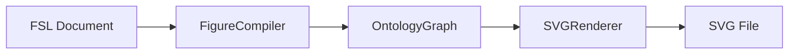

# Figure Grammar

Language rules for the Figure Specification Language (FSL). Defines what belongs in FSL, what belongs in other layers, and how constructs relate.

**See also:** [FSL_SPEC.md](./FSL_SPEC.md), [OBJECT_MODEL.md](./OBJECT_MODEL.md), [FIELD_REFERENCE.md](./FIELD_REFERENCE.md)

---

## What FSL Is

FSL is a **declarative specification** for figure structure. An FSL document answers:

- What is this figure called? (`metadata`)
- What layout category does it use? (`layout`)
- Which template guides composition? (`template`)
- What content placeholders exist? (`content_slots`)
- Which slots appear in which panels? (`layout.panels[].object_refs`)
- What style, rule, and validation files apply? (`styles`, `rules`, `validation`)
- How should it be exported? (`export`)

FSL does **not** answer how pixels are drawn, where arrows point in coordinates, or what scientific facts mean.

---

## Layer Boundaries



| Layer | Contains | Must NOT contain |
|-------|----------|------------------|
| **FSL** | Panels, slots, references to repo files | Ontology entities, relationships, coordinates, render hints |
| **Ontology** | Typed entities, `contains` / `references` relationships | YAML layout syntax, style file contents |
| **Renderer** | Layout geometry, SVG primitives | Modifications to FSL or ontology source |

**The renderer never modifies FSL.** It reads a compiled ontology graph and produces output.

**The compiler converts FSL into ontology objects.** Mapping rules live in `compiler/mapping.py`.

---

## Top-Level Grammar

Every valid FSL document is a single YAML/JSON **object** with these top-level keys:

```
Figure ::= {
  fsl_version: string,
  metadata: Metadata,
  template: TemplateReference,
  layout: Layout,
  styles?: StylesConfig,
  content_slots?: ContentSlot[],
  rules?: RulesConfig,
  validation?: ValidationOptions,
  knowledge?: KnowledgeConfig,
  integrations?: object,
  export?: ExportOptions
}
```

Unknown top-level keys are **rejected** (`extra="forbid"` on the `Figure` model).

---

## Core Rules

### Rule 1: Every figure has metadata

`metadata.id` and `metadata.title` are required. The figure root ontology entity is namespaced from `metadata.id` (e.g. `fig-001:figure:fig-001`).

### Rule 2: Every figure has exactly one layout

`layout.type` declares the layout **category**. `layout.panels` lists panel definitions. Panel count must satisfy rules for that type (see [LAYOUT_GUIDE.md](./LAYOUT_GUIDE.md)).

### Rule 3: Panels own references to content slots — not content directly

A panel's `object_refs` is a list of **content slot IDs**. Panels do not contain nested slot objects, ontology IDs, or inline labels.

```
✓ panel.object_refs: ["slot-1", "slot-2"]
✗ panel.slots: [{ id: "slot-1", ... }]
✗ panel.entities: [{ type: "Label", ... }]
```

### Rule 4: Content slots are defined once at figure scope

All slots live in `content_slots[]`. Panels only **reference** them by `id`. A slot may be referenced by one or more panels (multi-panel figures).

### Rule 5: Panels do not contain ontology entities

Ontology entity types (`Label`, `Arrow`, `Cell`, `Molecule`, etc.) exist **after compilation**. In FSL you declare slots with a `type` string; the compiler maps that string to an ontology entity type.

### Rule 6: Relationships belong to the ontology layer

FSL has no syntax for `contains`, `connected_to`, or `references`. The compiler emits:

- `figure CONTAINS panel`
- `panel CONTAINS slot`
- `figure REFERENCES style_annotation`

Do not add relationship blocks to FSL.

### Rule 7: Template and layout type must be consistent

`template.ref` must point to a known repository template. `layout.type` must be a known layout identifier. Align template choice with layout intent (see [LAYOUT_GUIDE.md](./LAYOUT_GUIDE.md)).

### Rule 8: IDs must be unique within their namespace

- Panel IDs must be unique within `layout.panels`
- Content slot IDs must be unique within `content_slots`
- The same string may appear as both a panel ID and slot ID — the compiler namespaces them separately (`:panel:` vs `:slot:`)

### Rule 9: Every slot must be used

The compiler rejects **orphan slots** — content slots not referenced by any panel's `object_refs`. Define only slots you place in a panel.

### Rule 10: fsl_version must be supported

Currently supported: `0.3.0`, `0.2.0-draft`. New documents should use `0.3.0`.

---

## Identifier Grammar

| Kind | Where defined | Referenced by |
|------|---------------|-------------|
| Figure ID | `metadata.id` | Export naming, ontology root namespace |
| Panel ID | `layout.panels[].id` | Internal only; not used in `object_refs` |
| Slot ID | `content_slots[].id` | `layout.panels[].object_refs` |

**`object_refs` values are slot IDs, not panel IDs.**

---

## Content Slot Type Grammar

`content_slots[].type` is an optional string. The compiler maps it to an ontology entity type:

| FSL `type` value | Ontology entity |
|------------------|-----------------|
| `placeholder`, `text`, `label` | `Label` |
| `image`, `asset` | `ImageAsset` |
| `arrow` | `Arrow` |
| `annotation` | `Annotation` |
| `shape`, `structure` | `Shape` |
| `molecule`, `protein`, `ligand`, etc. | Matching scientific entity type |
| omitted or unknown | `Shape` (default) |

Using scientific type strings (`protein`, `molecule`) is **structural only** — FSL does not embed scientific data. Prefer neutral types (`placeholder`, `shape`, `label`) unless the user supplies content.

---

## Reference Path Grammar

Repository paths use forward slashes, relative to repo root:

```
templates/single-panel.md
styles/color-system.md
rules/composition.md
validation/pre-export-checklist.md
```

**Template refs are validated** against `KNOWN_TEMPLATES`. **Style refs are not semantically validated** by the FSL engine today — still use paths that exist under `styles/`.

---

## What FSL Cannot Express (Today)

Do not invent syntax for these — they are not in the implementation:

- Absolute or relative coordinates
- Arrow source/target bindings between slots
- Z-order, layers, or grouping beyond panels
- `free-layout` or `grid` layout types (not in `KNOWN_LAYOUT_TYPES`)
- Inline SVG or image binary data (use `value` on slots when user supplies URIs/paths)
- Relationship declarations

---

## Compilation Grammar Summary

```
FSL Figure
  ├── metadata.id  ──────────►  Cell (figure root)
  ├── layout.panels[]  ──────►  Cell (panel) + CONTAINS → slots
  ├── content_slots[]  ──────►  Label | Shape | Arrow | ...
  └── styles.refs[]  ────────►  Annotation + REFERENCES from figure
```

Full mapping detail: [OBJECT_MODEL.md](./OBJECT_MODEL.md)

---

## Validation Grammar Summary

1. **Schema** — Pydantic validates types and required fields
2. **Semantic** — `FSLValidator` checks versions, templates, layout counts, ID uniqueness, slot references
3. **Compilation** — `CompilerValidator` checks mapping completeness and orphan slots
4. **Ontology** — `OntologyValidator` checks entity/relationship integrity
5. **Render** — Layout and SVG generation (structural only; no FSL feedback)

Detail: [VALIDATION_RULES.md](./VALIDATION_RULES.md)

---

## Counterexamples

### Counterexample: Ontology entity in FSL

```yaml
# INVALID — ontology concepts do not belong in FSL
layout:
  panels:
    - id: panel-a
      entities:
        - type: Label
          id: fig-001:slot:slot-1
```

**Why invalid:** Entity types and namespaced ontology IDs are compiler output, not FSL input.

### Counterexample: Relationship in FSL

```yaml
# INVALID — no relationship syntax in FSL
relationships:
  - type: contains
    source: panel-a
    target: slot-1
```

**Why invalid:** Relationships are created by the compiler.

### Counterexample: Slot defined only inside panel

```yaml
# INVALID — slots must be in content_slots[]
layout:
  panels:
    - id: panel-a
      object_refs: ["slot-1"]
# missing content_slots entry for slot-1
```

**Why invalid:** Schema may pass if slot list is empty, but semantic/compile validation fails on unknown or orphan references.

---

## Related Documents

- [FSL_SPEC.md](./FSL_SPEC.md) — field semantics
- [LAYOUT_GUIDE.md](./LAYOUT_GUIDE.md) — layout types
- [COMMON_ERRORS.md](./COMMON_ERRORS.md) — mistake catalog
- [EXAMPLES.md](./EXAMPLES.md) — valid documents