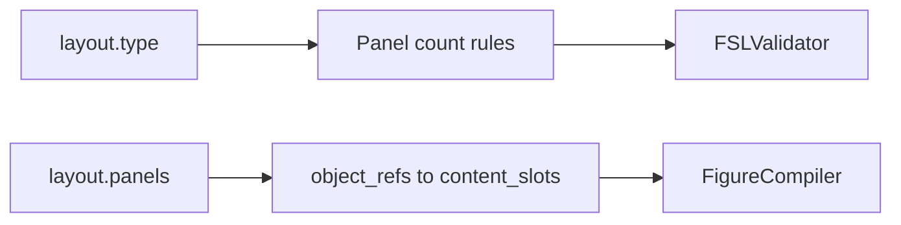

# Layout Guide

Conceptual guide to FSL layouts. Maps human layout intent to implementation identifiers.

**See also:** [FSL_SPEC.md](./FSL_SPEC.md), [EXAMPLES.md](./EXAMPLES.md), [FIELD_REFERENCE.md](./FIELD_REFERENCE.md)

**Source of truth:** `src/figure_agent/core/constants.py` (`KNOWN_LAYOUT_TYPES`, `LAYOUT_PANEL_RULES`)

---

## Layout Model

A layout has two parts:

1. **`layout.type`** — category enforcing panel count rules
2. **`layout.panels`** — list of regions, each referencing content slots

Layouts do **not** specify pixel positions, grid cells, or coordinates. The renderer applies a simple automatic layout.



---

## Supported Layout Types

| `layout.type` | Min panels | Max panels | Typical use |
|---------------|------------|------------|-------------|
| `single-panel` | 1 | 1 | One visual region |
| `multi-panel` | 2 | unlimited | Side-by-side or stacked regions |
| `schematic-flow` | 1 | unlimited | Sequential / flow diagrams |
| `comparison-layout` | 2 | unlimited | Side-by-side comparison |

### NOT supported (do not use)

These appear in informal design language but **are not** in `KNOWN_LAYOUT_TYPES`:

- `free-layout`
- `grid`
- `two-panel` (use `multi-panel` with 2 panels)
- `three-panel` (use `multi-panel` with 3 panels)
- `workflow` (use `schematic-flow`)

Using unsupported types causes: `layout.type 'X' is unknown`

---

## Conceptual Mapping

### Single panel

**Intent:** One canvas, one primary region.

**FSL:**

```yaml
layout:
  type: "single-panel"
  panels:
    - id: "panel-a"
      zones: ["primary"]
      object_refs: ["slot-1"]
template:
  ref: "templates/single-panel.md"
```

**Rules:** Exactly 1 panel. Using 0 or 2+ panels fails validation.

---

### Two panel

**Intent:** Two adjacent regions (e.g. left/right).

**FSL:** Use `multi-panel` or `comparison-layout` with 2 panels.

```yaml
layout:
  type: "multi-panel"
  panels:
    - id: "panel-a"
      zones: ["left"]
      object_refs: ["slot-1"]
    - id: "panel-b"
      zones: ["right"]
      object_refs: ["slot-2"]
template:
  ref: "templates/multi-panel.md"
```

**Rules:** Minimum 2 panels. Each slot referenced by exactly one panel avoids orphans.

---

### Three panel

**Intent:** Three regions (e.g. top + bottom row).

**FSL:** Use `multi-panel` with 3 panels.

```yaml
layout:
  type: "multi-panel"
  panels:
    - id: "panel-a"
      object_refs: ["slot-1"]
    - id: "panel-b"
      object_refs: ["slot-2"]
    - id: "panel-c"
      object_refs: ["slot-3"]
```

**Rules:** `multi-panel` allows 2+ panels — three is valid.

---

### Comparison

**Intent:** Juxtapose two or more conditions for visual comparison.

**FSL:** Prefer `comparison-layout` with aligned panel structure.

```yaml
layout:
  type: "comparison-layout"
  panels:
    - id: "panel-control"
      zones: ["left"]
      object_refs: ["slot-control"]
    - id: "panel-treatment"
      zones: ["right"]
      object_refs: ["slot-treatment"]
template:
  ref: "templates/comparison-layout.md"
```

**Rules:** Minimum 2 panels. Do not invent biological labels unless user-supplied — use neutral slot labels.

---

### Workflow / schematic flow

**Intent:** Sequential steps, process flow, pathway overview.

**FSL:** Use `schematic-flow` with one or more panels containing step slots.

```yaml
layout:
  type: "schematic-flow"
  panels:
    - id: "panel-flow"
      zones: ["flow"]
      object_refs: ["slot-step-1", "slot-step-2", "slot-arrow-1"]
template:
  ref: "templates/schematic-flow.md"
```

**Rules:** Minimum 1 panel. Multiple panels allowed for phased flows. Use `type: arrow` slots for connections (renderer draws simple arrows).

---

### Free layout / grid

**Intent:** Arbitrary positioning or grid cells.

**Status:** **Not implemented.** FSL has no coordinate or grid fields. Do not invent `layout.type: grid` or position properties.

**Alternative:** Use `multi-panel` with multiple panels and neutral zones. Accept that the SVG renderer stacks content vertically within each panel.

---

## Template Alignment

Pair `layout.type` with a sensible `template.ref`:

| layout.type | Recommended template.ref |
|-------------|--------------------------|
| `single-panel` | `templates/single-panel.md` |
| `multi-panel` | `templates/multi-panel.md` |
| `schematic-flow` | `templates/schematic-flow.md` |
| `comparison-layout` | `templates/comparison-layout.md` |

`templates/legend-block.md` is valid for any layout when a legend is needed — it does not define a separate layout type.

---

## Zones

`panels[].zones` are **semantic labels** for subregions. They are stored in panel metadata but do not drive strict layout geometry in v0.6.

**When to use:** Document intent (`primary`, `left`, `legend`, `inset`).

**When NOT to use:** Do not treat zones as grid coordinates or CSS positions.

---

## Panel–Slot Assignment Rules

1. Every `content_slots[].id` must appear in at least one `object_refs` list
2. Every `object_refs` entry must match a defined slot ID
3. A slot may appear in multiple panels only if intentional (unusual; test compile)
4. Panel IDs and slot IDs live in separate namespaces

---

## Renderer Behavior (v0.6)

| Layout | Render arrangement |
|--------|-------------------|
| Single panel | One panel boundary; slots stacked vertically inside |
| Multi-panel | Panels arranged horizontally; slots stacked per panel |
| schematic-flow / comparison-layout | Same as multi-panel (horizontal panels) |

Do not promise BioRender-quality layout from FSL alone.

---

## Validation Errors

| Error | Cause |
|-------|-------|
| `requires at least N panel(s)` | Too few panels for type |
| `allows at most N panel(s)` | Too many panels for `single-panel` |
| `layout.type 'X' is unknown` | Unsupported type string |
| `references unknown object` | `object_refs` typo |
| `orphaned` | Slot not in any `object_refs` |

See [COMMON_ERRORS.md](./COMMON_ERRORS.md).

---

## Related

- [EXAMPLES.md](./EXAMPLES.md) — full layout examples
- [FIGURE_GRAMMAR.md](./FIGURE_GRAMMAR.md) — panel/slot grammar
- [PROMPTING_GUIDE.md](./PROMPTING_GUIDE.md) — asking users for layout intent