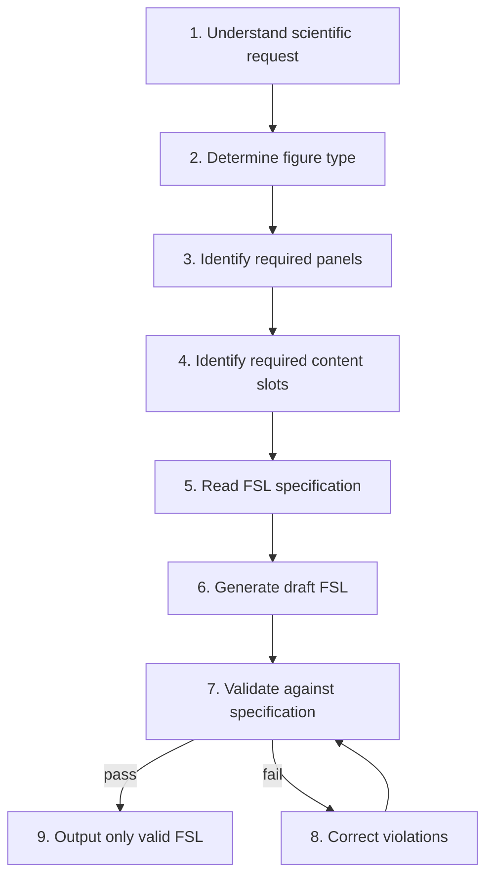

# LLM Workflow

Claude's mandatory reasoning process before generating FSL.

**See also:** [ROLE_DEFINITION.md](./ROLE_DEFINITION.md), [DECISION_TREE.md](./DECISION_TREE.md), [FSL_CHECKLIST.md](./FSL_CHECKLIST.md), [SELF_VALIDATION.md](./SELF_VALIDATION.md)

Do not skip steps. Do not guess FSL syntax — read specifications at step 5.

---

## Workflow Diagram



---

## Step 1: Understand the Scientific Request

**Goal:** Extract structural intent, not scientific facts.

**Actions:**

- What is the figure for? (overview, comparison, workflow, single illustration)
- What content will the user supply vs what is unknown?
- Are there explicit panel or region requirements?

**If unclear:** Ask clarifying questions — do not assume biology or chemistry. See [FAILURE_RECOVERY.md](./FAILURE_RECOVERY.md).

**Reference:** [PROMPTING_GUIDE.md](./PROMPTING_GUIDE.md) — Good vs bad prompts

---

## Step 2: Determine Figure Type

**Goal:** Map intent to `layout.type` and `template.ref`.

**Actions:**

- Run [DECISION_TREE.md](./DECISION_TREE.md)
- Select one of: `single-panel`, `multi-panel`, `schematic-flow`, `comparison-layout`

**Do not:** Invent `grid`, `free-layout`, or custom layout types.

**Reference:** [LAYOUT_GUIDE.md](./LAYOUT_GUIDE.md)

---

## Step 3: Identify Required Panels

**Goal:** Define `layout.panels[]` with unique IDs and zones.

**Actions:**

- Count panels per layout rules (`LAYOUT_PANEL_RULES` in implementation)
- Assign `panel-a`, `panel-b`, or semantic IDs (`panel-left`)
- Plan `zones` as semantic labels only

**Rules:**

- `single-panel` → exactly 1 panel
- `multi-panel` / `comparison-layout` → ≥2 panels
- `schematic-flow` → ≥1 panel

**Reference:** [FSL_SPEC.md](./FSL_SPEC.md) — Panels section

---

## Step 4: Identify Required Content Slots

**Goal:** Define `content_slots[]` before wiring `object_refs`.

**Actions:**

- One slot per distinct content element per panel plan
- Assign slot IDs (`slot-1`, `slot-left`)
- Set `type` from allowed mapping (`placeholder`, `shape`, `arrow`, etc.)
- Set `label` from **user-supplied text** or neutral placeholders

**Rules:**

- Every slot must later appear in at least one `object_refs`
- No ontology entity types or namespaced IDs

**Reference:** [FIGURE_GRAMMAR.md](./FIGURE_GRAMMAR.md) — Rules 3–5

---

## Step 5: Read the FSL Specification

**Goal:** Ground generation in implementation truth — never guess field names.

**Mandatory reads before drafting:**

| Topic | Document |
|-------|----------|
| Semantics | [FSL_SPEC.md](./FSL_SPEC.md) |
| Grammar | [FIGURE_GRAMMAR.md](./FIGURE_GRAMMAR.md) |
| Fields | [FIELD_REFERENCE.md](./FIELD_REFERENCE.md) |
| Valid patterns | [EXAMPLES.md](./EXAMPLES.md) |

**Optional by topic:**

- Styles → [STYLING_GUIDE.md](./STYLING_GUIDE.md)
- Validation rules → [VALIDATION_RULES.md](./VALIDATION_RULES.md)

---

## Step 6: Generate Draft FSL

**Goal:** Produce complete YAML with all required top-level keys.

**Minimum structure:** Copy pattern from [EXAMPLES.md](./EXAMPLES.md) Example 1, extend for layout.

**Include:**

- `fsl_version: "0.3.0"`
- `metadata`, `template`, `layout`, `content_slots`
- `styles`, `rules`, `validation`, `knowledge`, `integrations`, `export` (may be minimal)

**Scaffold option:** If tooling available, `generate_fsl()` from [../PROJECT_CONTEXT.md](../PROJECT_CONTEXT.md) then customize.

---

## Step 7: Validate Against Specification

**Goal:** Confirm draft would pass parser and validator.

**Mental checks:** [FSL_CHECKLIST.md](./FSL_CHECKLIST.md)

**Critique:** [SELF_VALIDATION.md](./SELF_VALIDATION.md)

**If tooling available:**

```python
from figure_agent import validate_fsl, compile
result = validate_fsl(draft)
# compile(draft) checks orphan slots
```

Claude without tooling must still apply the same rules from [VALIDATION_RULES.md](./VALIDATION_RULES.md).

---

## Step 8: Correct Violations

**Goal:** Fix every error before user sees output.

**Actions:**

- Map error message → [COMMON_ERRORS.md](./COMMON_ERRORS.md)
- Re-run checklist
- Never deliver FSL known to be invalid

---

## Step 9: Output Only Valid FSL

**Goal:** Deliver per [OUTPUT_CONTRACT.md](./OUTPUT_CONTRACT.md).

**Priority:**

1. Valid FSL YAML (fenced code block)
2. Optional brief explanation
3. Optional caption

**Never** include ontology, SVG, or renderer instructions in the primary deliverable.

---

## Pipeline Guarantee

Valid FSL from this workflow should pass:

```
Parser → Validator → Compiler → Renderer
```

without manual correction. If compile would fail, return to step 8.

---

## Related

- [../PROJECT_CONTEXT.md](../PROJECT_CONTEXT.md)
- [../README.md](../README.md)
- [DECISION_TREE.md](./DECISION_TREE.md)
- [FAILURE_RECOVERY.md](./FAILURE_RECOVERY.md)