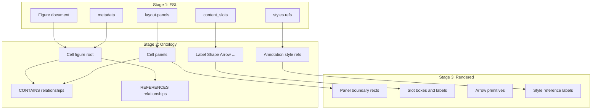
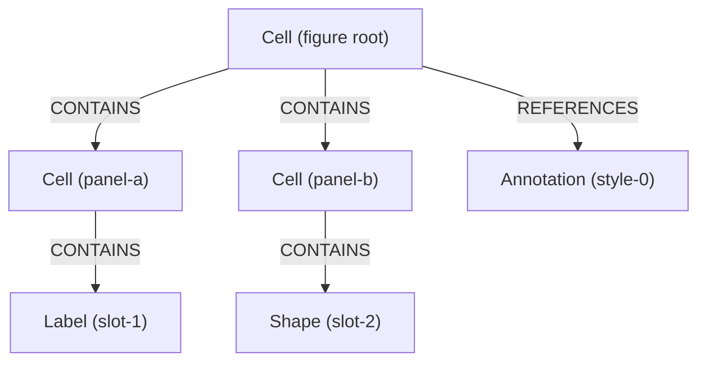

# Object Model

How FSL objects transform into ontology entities and rendered output.

**See also:** [FIGURE_GRAMMAR.md](./FIGURE_GRAMMAR.md), [FSL_SPEC.md](./FSL_SPEC.md), [VALIDATION_RULES.md](./VALIDATION_RULES.md)

---

## Three-Stage Pipeline



| Stage | Artifact | Mutable by renderer? |
|-------|----------|----------------------|
| FSL | YAML/JSON document | No |
| Ontology | `OntologyGraph` (entities + relationships) | No |
| Rendered | SVG string / file | Output only |

---

## FSL Object → Ontology Entity

### Figure root

| FSL source | Ontology output |
|------------|-----------------|
| `metadata.id`, `metadata.title` | `Cell` with id `{figure_id}:figure:{figure_id}` |
| `fsl_version`, `layout.type`, `template`, `export` | Stored in root `metadata` dict |

### Panel

| FSL source | Ontology output |
|------------|-----------------|
| `layout.panels[].id` | `Cell` with id `{figure_id}:panel:{panel_id}` |
| `zones`, `object_refs` | Panel `metadata` |

### Content slot

| FSL `type` | Ontology entity | Rendered as (SVG v0.6) |
|------------|-----------------|------------------------|
| `placeholder`, `text`, `label` | `Label` | Rectangle + centered text |
| `shape`, `structure`, unknown | `Shape` | Rectangle |
| `arrow` | `Arrow` | Line + arrowhead |
| `annotation` | `Annotation` | Rounded rectangle |
| `image`, `asset` | `ImageAsset` | Rectangle (no image embed) |
| Scientific types (`protein`, etc.) | Matching entity type | Rectangle (proof-of-concept) |

### Style reference

| FSL source | Ontology output |
|------------|-----------------|
| `styles.refs[i].ref` | `Annotation` with id `{figure_id}:style:style-{i}` |
| — | `metadata.kind = style_reference` |

---

## Relationships (Compiler-Generated)

FSL defines **zero** relationships. The compiler creates:



| Relationship | Source | Target | When created |
|--------------|--------|--------|--------------|
| `contains` | Figure root | Panel | One per panel |
| `contains` | Panel | Slot | One per `object_ref` |
| `references` | Figure root | Style annotation | One per `styles.refs` entry |

Relationship types **not** created from FSL today: `connected_to`, `annotates`, `located_in`, `interacts_with`.

---

## ID Namespacing

FSL uses simple IDs (`panel-a`, `slot-1`). Ontology uses namespaced IDs:

```
{figure_metadata.id}:{kind}:{fsl_id}
```

Examples for `metadata.id: fig-001`:

- `fig-001:figure:fig-001`
- `fig-001:panel:panel-a`
- `fig-001:slot:slot-1`
- `fig-001:style:style-0`
- `fig-001:rel:panel-contains-panel-a-slot-1`

**LLMs write simple IDs in FSL.** Never emit namespaced ontology IDs in FSL documents.

---

## Ontology Entity → Rendered Object

The SVG renderer (`SVGRenderer`) performs simple layout:

1. Find figure root and panels via `CONTAINS` hierarchy
2. Stack panel children vertically with constant spacing
3. Arrange panels horizontally for multi-panel figures
4. Map entity types to primitives (rect, text, line)
5. Draw style annotations as a footer row

| Ontology entity | Rendered output |
|-----------------|-----------------|
| `Cell` (panel) | Rounded rectangle boundary + panel id label |
| `Label` | Rectangle + centered `label`/`text` |
| `Shape` | Rectangle |
| `Arrow` | Straight line with arrowhead |
| `Annotation` (style) | Small rounded rect + ref path text |

The renderer does **not**:

- Read FSL YAML
- Modify ontology entities
- Apply colors from `styles/` files (monochrome palette only in v0.6)

---

## Minimal Figure Object Count

For `examples/minimal_figure.yaml`:

| Stage | Count | Contents |
|-------|-------|----------|
| FSL panels | 1 | `panel-a` |
| FSL slots | 1 | `slot-1` |
| Ontology entities | 4 | figure, panel, slot, style annotation |
| Ontology relationships | 3 | figure→panel, panel→slot, figure→style |

---

## Transformation Rules Summary

1. **FSL is the source of truth for structure** — edit FSL to change what appears in figures
2. **Re-compile after FSL changes** — ontology is derived, not authoritative
3. **Re-render after compile** — SVG is derived from ontology
4. **Do not edit ontology JSON by hand** when generating figures from LLM output — produce FSL instead

---

## API Entry Points

| Operation | Function | Input | Output |
|-----------|----------|-------|--------|
| Validate FSL | `validate_fsl()` | FSL dict/string | `ValidationResponse` |
| Compile | `compile()` | FSL | `CompileResponse.graph` |
| Render | `render_svg()` | FSL or graph | SVG string |

---

## Related

- [FIGURE_GRAMMAR.md](./FIGURE_GRAMMAR.md) — what FSL cannot express
- [EXAMPLES.md](./EXAMPLES.md) — worked transformations
- [COMMON_ERRORS.md](./COMMON_ERRORS.md) — mapping failures