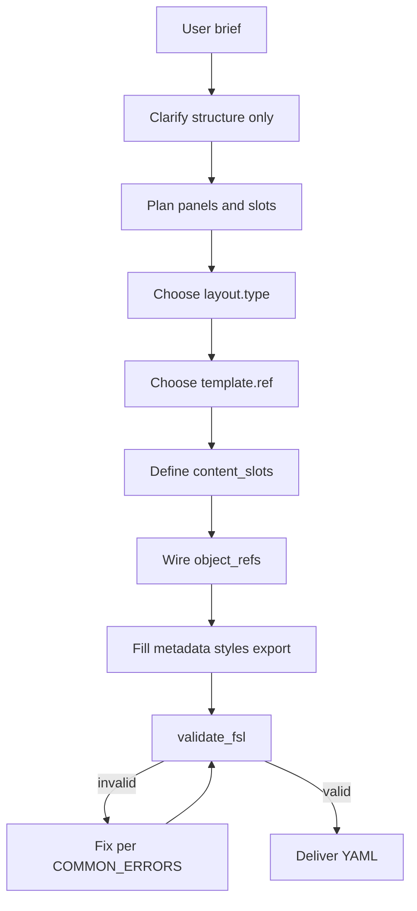

# Prompting Guide

How LLMs should produce valid FSL from user requests.

**See also:** [EXAMPLES.md](./EXAMPLES.md), [FIGURE_GRAMMAR.md](./FIGURE_GRAMMAR.md), [VALIDATION_RULES.md](./VALIDATION_RULES.md), [COMMON_ERRORS.md](./COMMON_ERRORS.md)

---

## Reasoning Strategy



**Generate structure, not science.** Ask for content; use placeholders in slots.

---

## Step-by-Step Procedure

### 1. Extract structural requirements

From the user brief, identify:

- How many visual regions? → number of panels
- What content placeholders? → slot labels (user-supplied text only)
- Comparison or flow? → layout type
- Export format needed? → `export.formats`

Do **not** infer biological mechanisms, compound names, or journal formatting.

### 2. Choose layout.type

| User says | Use |
|-----------|-----|
| "one panel", "single figure" | `single-panel` |
| "two panels", "side by side" | `multi-panel` (2 panels) |
| "three panels" | `multi-panel` (3 panels) |
| "compare A and B" | `comparison-layout` |
| "workflow", "pathway", "steps" | `schematic-flow` |
| "free layout", "grid" | Explain limitation; use `multi-panel` |

### 3. Assign IDs

- Figure: `fig-{short-name}` (e.g. `fig-001`)
- Panels: `panel-a`, `panel-b`, or semantic `panel-left`
- Slots: `slot-1`, `slot-{purpose}`

Keep IDs simple — no colons, no ontology prefixes.

### 4. Define content_slots first, then object_refs

Always define slots at figure scope, then reference from panels.

### 5. Add repository references

Minimum viable:

```yaml
template:
  ref: "templates/single-panel.md"  # match layout
styles:
  refs:
    - ref: "styles/color-system.md"
```

### 6. Validate before delivering

```python
from figure_agent import validate_fsl, compile

result = validate_fsl(document)
if not result.valid:
    # fix errors — do not deliver broken FSL
    ...
compiled = compile(document)
```

---

## Good Prompts (User → LLM)

### Good: structural brief

> "Create a two-panel FSL figure spec. Left panel: user content placeholder. Right panel: secondary placeholder. Export as SVG."

**Why good:** Specifies panel count and export without inventing science.

**Expected output:** Example 2 pattern from [EXAMPLES.md](./EXAMPLES.md).

### Good: workflow brief

> "Generate FSL for a 3-step schematic flow with arrows between steps. Use neutral step labels — I will fill in content later."

**Why good:** User explicitly defers content; LLM uses `schematic-flow` and `type: arrow`.

### Good: minimal spec

> "Minimal valid FSL document with one panel and one placeholder slot."

**Expected output:** Example 1 — can copy `examples/minimal_figure.yaml` structure.

### Good: validation request

> "Here is my FSL YAML. Fix any validation errors and explain what was wrong."

**Why good:** LLM should run `validate_fsl()`, cite [COMMON_ERRORS.md](./COMMON_ERRORS.md), return corrected YAML.

---

## Bad Prompts (and how to handle)

### Bad: invent content

> "Create a figure showing EGFR inhibition in lung cancer with IC50 values."

**Problem:** Requests fabricated scientific content.

**LLM response:** Decline to invent data. Offer FSL with neutral placeholders:

```yaml
content_slots:
  - id: "slot-mechanism"
    label: "User-supplied mechanism diagram"
    type: "placeholder"
    value: null
```

### Bad: ontology in FSL

> "Add a contains relationship from panel-a to slot-1 in the YAML."

**Problem:** Relationships are not FSL syntax.

**LLM response:** Explain [FIGURE_GRAMMAR.md](./FIGURE_GRAMMAR.md) Rule 6. Use `object_refs` only.

### Bad: unsupported layout

> "Use a 4x3 grid layout."

**Problem:** `grid` is not supported.

**LLM response:** Explain limitation from [LAYOUT_GUIDE.md](./LAYOUT_GUIDE.md). Propose `multi-panel` with 12 slots across panels as approximation, or ask user to simplify.

### Bad: journal styles

> "Format for Nature Reviews Drug Discovery."

**Problem:** Journal standards are not defined in repo.

**LLM response:** Use repository `styles/` refs only. Note that journal-specific validation is not implemented.

---

## Expected Outputs

When asked to "generate FSL", deliver:

1. **Complete YAML document** — all required top-level keys
2. **Brief validity statement** — "Passes `validate_fsl()` and `compile()`"
3. **Structural summary** — N panels, M slots, layout type
4. **No fabricated science** — list placeholders needing user input

Optional: offer `export()` command to produce SVG preview.

---

## Error Recovery

| Situation | Action |
|-----------|--------|
| Schema error | Check [FIELD_REFERENCE.md](./FIELD_REFERENCE.md) for missing fields |
| Unknown template | Switch to known template list |
| Unknown layout | Switch to `KNOWN_LAYOUT_TYPES` |
| Unknown object ref | Add slot or fix typo in `object_refs` |
| Orphan slot | Add to `object_refs` or remove slot |
| Compile fails after valid FSL | Report as potential bug — valid FSL should compile |

**Never** silence errors by disabling validation.

---

## Clarifying Questions to Ask Users

When the brief is ambiguous, ask:

1. **How many panels/regions** do you need?
2. **Is this a comparison** (two conditions side-by-side) or a **flow** (sequential steps)?
3. **What labels** should each content slot have? (User must supply text)
4. **What export format** — SVG, PNG, or both?
5. **Any specific style files** from `styles/` to reference?

Do **not** ask:

- "What is the IC50?" (scientific data)
- "Which journal?" (unless user raised export standards)
- "What color should EGFR be?" (use style refs)

---

## API Shortcuts for LLMs

```python
from figure_agent import generate_fsl, validate_fsl, compile, export
from figure_agent.api import GenerateFSLRequest, ContentSlotSpec

# Scaffold valid FSL
gen = generate_fsl(GenerateFSLRequest(
    figure_id="fig-demo",
    title="Demo",
    slots=(ContentSlotSpec(id="slot-1", label="Primary"),),
))

# Customize gen.document, then validate
assert validate_fsl(gen.document).valid

# Export preview
export(gen.document, "output/preview.svg")
```

`generate_fsl()` produces valid baseline documents — customize panels/slots from there.

---

## Pre-Delivery Checklist

- [ ] Read [FIGURE_GRAMMAR.md](./FIGURE_GRAMMAR.md) rules
- [ ] `fsl_version: "0.3.0"`
- [ ] Panel count matches `layout.type`
- [ ] All slots wired via `object_refs`
- [ ] No relationships or ontology IDs in FSL
- [ ] No fabricated scientific content
- [ ] `validate_fsl()` returns `valid: true`
- [ ] `compile()` returns `success: true`

---

## Related

- [specs/README.md](./README.md) — document index
- [PROJECT_CONTEXT.md](../PROJECT_CONTEXT.md) — repo-wide agent context
- [EXAMPLES.md](./EXAMPLES.md) — copy-paste patterns