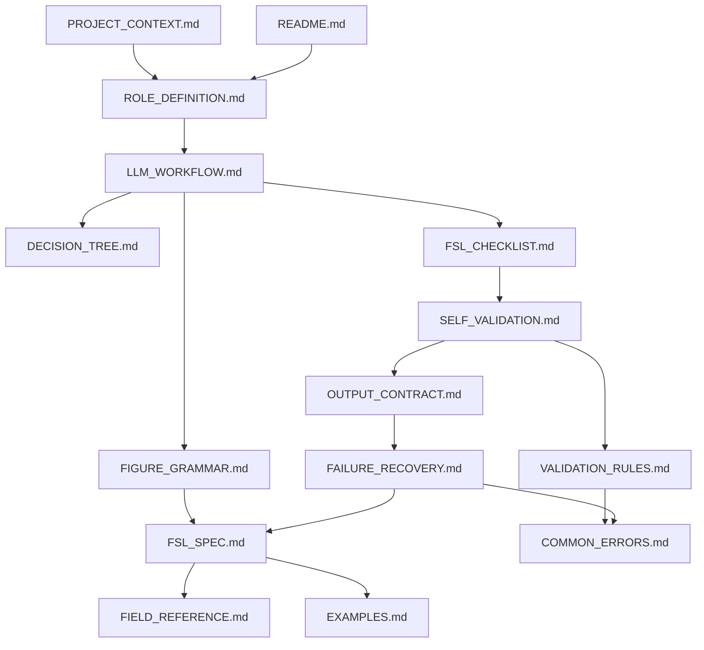

# LLM Specification Layer

Reasoning specifications for Large Language Models generating valid Figure Specification Language (FSL) documents.

**This is not user documentation, API documentation, or developer documentation.**

It is the semantic layer that teaches Claude and future LLMs how to think about, construct, and validate FSL.

**Synchronized with:** Figure Agent v0.8.0 (`src/figure_agent/fsl/`, `compiler/`, `ontology/`, `renderers/`)

---

## Who Should Read This

- **Claude** (Claude Projects / Skill) — start at [ROLE_DEFINITION.md](./ROLE_DEFINITION.md) and [LLM_WORKFLOW.md](./LLM_WORKFLOW.md)
- LLMs asked to **generate**, **edit**, or **validate** FSL YAML/JSON
- Agents using `generate_fsl()` or producing figure specifications by hand
- Prompt engineers wiring figure-design workflows

Humans maintaining the platform should use [../README.md](../README.md), `docs/`, and `fsl/` instead.

---

## Claude Reasoning Layer (v0.8)

Mandatory workflow for deterministic FSL generation:

| Document | Purpose |
|----------|---------|
| [ROLE_DEFINITION.md](./ROLE_DEFINITION.md) | What Claude does and does not do |
| [LLM_WORKFLOW.md](./LLM_WORKFLOW.md) | 9-step reasoning process |
| [DECISION_TREE.md](./DECISION_TREE.md) | Layout/template decisions |
| [FSL_CHECKLIST.md](./FSL_CHECKLIST.md) | Pre-output verification (machine-readable) |
| [SELF_VALIDATION.md](./SELF_VALIDATION.md) | Self-critique before responding |
| [OUTPUT_CONTRACT.md](./OUTPUT_CONTRACT.md) | Allowed response format |
| [FAILURE_RECOVERY.md](./FAILURE_RECOVERY.md) | When not to guess |

**Claude entry path:** `ROLE_DEFINITION` → `LLM_WORKFLOW` → `DECISION_TREE` → draft → `FSL_CHECKLIST` + `SELF_VALIDATION` → `OUTPUT_CONTRACT`

---

## FSL Specification Documents (v0.7)

| Document | Purpose |
|----------|---------|
| [FSL_SPEC.md](./FSL_SPEC.md) | Semantic meaning of every major FSL construct |
| [FIGURE_GRAMMAR.md](./FIGURE_GRAMMAR.md) | Language rules and layer boundaries |
| [FIELD_REFERENCE.md](./FIELD_REFERENCE.md) | Alphabetical field reference |
| [OBJECT_MODEL.md](./OBJECT_MODEL.md) | FSL object → ontology entity → rendered output |
| [LAYOUT_GUIDE.md](./LAYOUT_GUIDE.md) | Layout types and panel composition |
| [STYLING_GUIDE.md](./STYLING_GUIDE.md) | Style references and overrides |
| [VALIDATION_RULES.md](./VALIDATION_RULES.md) | Four validation stages |
| [COMMON_ERRORS.md](./COMMON_ERRORS.md) | Mistakes and corrections |
| [EXAMPLES.md](./EXAMPLES.md) | Valid examples with reasoning |
| [PROMPTING_GUIDE.md](./PROMPTING_GUIDE.md) | General LLM prompting patterns |

---

## Reading Order for Claude

1. [../PROJECT_CONTEXT.md](../PROJECT_CONTEXT.md) — repo boundaries
2. [ROLE_DEFINITION.md](./ROLE_DEFINITION.md) — Claude's role
3. [LLM_WORKFLOW.md](./LLM_WORKFLOW.md) — mandatory steps
4. [DECISION_TREE.md](./DECISION_TREE.md) — layout decisions
5. [FIGURE_GRAMMAR.md](./FIGURE_GRAMMAR.md) — what FSL is not
6. [FSL_SPEC.md](./FSL_SPEC.md) + [EXAMPLES.md](./EXAMPLES.md) — semantics and patterns
7. [FSL_CHECKLIST.md](./FSL_CHECKLIST.md) + [SELF_VALIDATION.md](./SELF_VALIDATION.md) — before output
8. [OUTPUT_CONTRACT.md](./OUTPUT_CONTRACT.md) — deliverable format

**On failure:** [FAILURE_RECOVERY.md](./FAILURE_RECOVERY.md) → [COMMON_ERRORS.md](./COMMON_ERRORS.md)

---

## Hard Rules for LLMs

1. **FSL describes structure, not rendered graphics.** Panels reference content slots; they do not embed ontology entities, coordinates, or relationships.
2. **Do not invent biology, chemistry, or journal standards.** Use neutral placeholders and repository paths that exist.
3. **Do not invent layout types.** Only use values from `KNOWN_LAYOUT_TYPES` in the implementation.
4. **Every panel `object_ref` must match a `content_slots[].id`.** Every slot must be referenced by at least one panel (compiler orphan check).
5. **Relationships exist only in the ontology layer.** The compiler creates `contains` and `references` relationships; FSL has no relationship syntax.
6. **Validate before claiming success.** Apply [FSL_CHECKLIST.md](./FSL_CHECKLIST.md) or run `validate_fsl()` + `compile()`.

---

## Cross-Reference Graph

---

## Implementation Anchors

When in doubt, derive behavior from these source files — do not guess:

| Behavior | Source |
|----------|--------|
| FSL schema (types, required fields) | `src/figure_agent/fsl/models.py` |
| Semantic validation | `src/figure_agent/fsl/validator.py` |
| Supported versions, layouts, templates | `src/figure_agent/core/constants.py` |
| FSL → ontology mapping | `src/figure_agent/compiler/mapping.py` |
| Compilation validation | `src/figure_agent/compiler/validator.py` |
| Ontology validation | `src/figure_agent/ontology/validator.py` |
| Minimal valid example | `examples/minimal_figure.yaml` |

---

## Related (Outside This Layer)

| Resource | Audience |
|----------|----------|
| [../PROJECT_CONTEXT.md](../PROJECT_CONTEXT.md) | General agent context for the whole repo |
| [../README.md](../README.md) | Human project overview |
| [../CLAUDE.md](../CLAUDE.md) | Claude Skill entry point |
| `src/figure_agent/api/` | Python API for validate/compile/render |
| `fsl/schema.yaml` | Schema skeleton (not a substitute for semantics) |