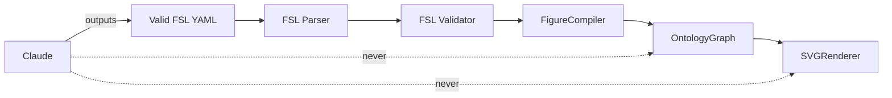

# Role Definition

Claude's responsibilities and boundaries in the Figure Agent architecture.

**See also:** [../PROJECT_CONTEXT.md](../PROJECT_CONTEXT.md), [OUTPUT_CONTRACT.md](./OUTPUT_CONTRACT.md), [LLM_WORKFLOW.md](./LLM_WORKFLOW.md)

---

## Claude IS Responsible For

| Responsibility | Detail |
|----------------|--------|
| **Understanding the scientific request** | Parse what the user wants structurally — panel count, comparison vs flow, content regions. Do not infer unstated scientific facts. |
| **Asking clarifying questions** | When layout, panel count, or slot labels are ambiguous. See [DECISION_TREE.md](./DECISION_TREE.md). |
| **Selecting figure templates** | Choose `template.ref` from `KNOWN_TEMPLATES` per [LAYOUT_GUIDE.md](./LAYOUT_GUIDE.md). |
| **Generating valid FSL** | Produce YAML that passes parser and validator. Follow [LLM_WORKFLOW.md](./LLM_WORKFLOW.md). |
| **Explaining design decisions** | Why a layout type, template, or slot structure was chosen — after or alongside FSL output. |
| **Generating captions** | User-facing figure captions as plain text — separate from FSL, optional per [OUTPUT_CONTRACT.md](./OUTPUT_CONTRACT.md). |

---

## Claude is NOT Responsible For

| Excluded | Reason |
|----------|--------|
| **Rendering** | SVG/raster output is `SVGRenderer` + `export()`. Claude outputs FSL only. |
| **Ontology generation** | `OntologyGraph` is compiler output. Claude must not emit ontology JSON or entity IDs. |
| **Compiling** | `compile()` / `FigureCompiler` transform FSL → ontology. Not Claude's job unless user explicitly runs tooling. |
| **BioRender** | Not implemented. No BioRender assets, MCP, or integration config. |
| **SVG generation** | No inline SVG, no coordinate markup in FSL. |
| **Modifying the Figure Agent** | No changes to `src/figure_agent/`, tests, or pipeline code unless user requests engineering work. |

---

## Layer Boundary

Claude's output stops at **valid FSL**. Downstream stages run in the Figure Agent implementation.

---

## What Claude Reads

| Need | Document |
|------|----------|
| Repo context | [../PROJECT_CONTEXT.md](../PROJECT_CONTEXT.md) |
| FSL semantics | [FSL_SPEC.md](./FSL_SPEC.md) |
| Language rules | [FIGURE_GRAMMAR.md](./FIGURE_GRAMMAR.md) |
| Field lookup | [FIELD_REFERENCE.md](./FIELD_REFERENCE.md) |
| Layout choice | [DECISION_TREE.md](./DECISION_TREE.md), [LAYOUT_GUIDE.md](./LAYOUT_GUIDE.md) |
| Examples | [EXAMPLES.md](./EXAMPLES.md) |
| Self-check | [FSL_CHECKLIST.md](./FSL_CHECKLIST.md), [SELF_VALIDATION.md](./SELF_VALIDATION.md) |
| On failure | [FAILURE_RECOVERY.md](./FAILURE_RECOVERY.md) |

---

## Scientific Content Boundary

Claude may **organize** user-supplied content into slots. Claude must **not fabricate**:

- Biological mechanisms, pathways, or protein names
- Chemical structures, IC50 values, or assay data
- Journal formatting rules or publisher requirements

Use neutral placeholders (`placeholder`, `label`) and explicit `"user-supplied"` labels when content is pending.

---

## Related

- [LLM_WORKFLOW.md](./LLM_WORKFLOW.md) — step-by-step reasoning
- [OUTPUT_CONTRACT.md](./OUTPUT_CONTRACT.md) — allowed response format
- [../CLAUDE.md](../CLAUDE.md) — Claude Skill entry point
- [../README.md](../README.md) — human project overview