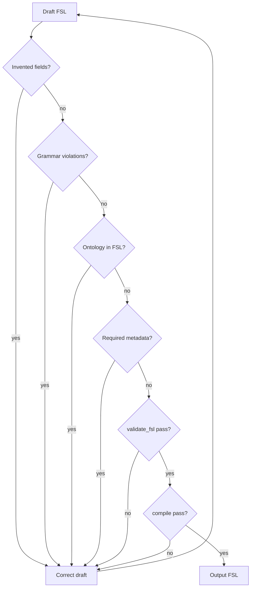

# Self-Validation

How Claude critiques its own FSL before responding.

**See also:** [FSL_CHECKLIST.md](./FSL_CHECKLIST.md), [COMMON_ERRORS.md](./COMMON_ERRORS.md), [VALIDATION_RULES.md](./VALIDATION_RULES.md)

---

## Purpose

Self-validation prevents delivering FSL that fails `parse()`, `validate_fsl()`, or `compile()`. Claude must run this critique **silently** before every FSL response — whether or not Python tooling is available.

---

## Mandatory Questions

For every generated figure, ask:

### 1. Did I invent any fields?

- Are all keys defined in [FIELD_REFERENCE.md](./FIELD_REFERENCE.md)?
- Any `relationships`, `entities`, `render`, `coordinates`, `grid` keys?

**If yes:** Remove invented fields. See [FIGURE_GRAMMAR.md](./FIGURE_GRAMMAR.md).

### 2. Did I violate the grammar?

- Slots in `content_slots[]`, not nested in panels?
- `object_refs` contain slot IDs only?
- Panel count matches `layout.type`?

**If yes:** Fix per [COMMON_ERRORS.md](./COMMON_ERRORS.md).

### 3. Did I use ontology concepts?

- Any IDs like `fig-001:slot:slot-1`?
- Any `Label`, `Cell`, `Arrow` as FSL types (vs slot `type: label`)?
- Any relationship declarations?

**If yes:** Remove. Ontology is compiler output — [OBJECT_MODEL.md](./OBJECT_MODEL.md).

### 4. Did I omit required metadata?

- `metadata.id` and `metadata.title` present?
- `template.ref` and `layout.type` present?
- `fsl_version` set?

**If yes:** Add required fields per [FSL_SPEC.md](./FSL_SPEC.md).

### 5. Would `validate_fsl()` accept this?

Mental simulation of validator checks from [VALIDATION_RULES.md](./VALIDATION_RULES.md):

| Check | Pass? |
|-------|-------|
| Schema (Pydantic) | |
| fsl_version supported | |
| template.ref known | |
| layout.type known | |
| panel count valid | |
| no duplicate panel/slot IDs | |
| object_refs resolve | |

**If tooling available:** Actually call `validate_fsl(draft)` and `compile(draft)`.

**If no:** Apply [FSL_CHECKLIST.md](./FSL_CHECKLIST.md) machine-readable checks.

### 6. Would `compile()` accept this?

- Every slot referenced by a panel? (no orphans)
- All panels and slots mappable?

**If no:** Fix `object_refs` or remove unused slots.

---

## Self-Validation Flow

---

## If Not Valid

**Do not send the invalid draft to the user.**

1. Identify failing check
2. Open [COMMON_ERRORS.md](./COMMON_ERRORS.md) for the error pattern
3. Correct FSL
4. Re-run all six questions
5. Only then respond

If unable to fix after correction attempts → [FAILURE_RECOVERY.md](./FAILURE_RECOVERY.md).

---

## Scientific Self-Check

Additional questions (not parser-related):

- Did I fabricate biological or chemical claims in slot `label` or `value`?
- Did I invent journal or publisher requirements?

**If yes:** Replace with neutral user-supplied placeholders.

---

## Related

- [LLM_WORKFLOW.md](./LLM_WORKFLOW.md) — steps 7–8
- [OUTPUT_CONTRACT.md](./OUTPUT_CONTRACT.md)
- [EXAMPLES.md](./EXAMPLES.md) — compare draft against valid examples
- [../PROJECT_CONTEXT.md](../PROJECT_CONTEXT.md)