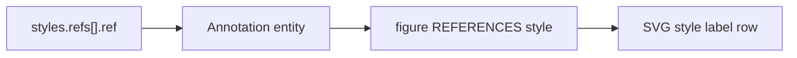

# Styling Guide

How FSL references visual style without embedding design tokens.

**See also:** [FSL_SPEC.md](./FSL_SPEC.md), [FIELD_REFERENCE.md](./FIELD_REFERENCE.md), [OBJECT_MODEL.md](./OBJECT_MODEL.md)

**Do not invent journal styles or publisher branding.**

---

## Purpose of Styles in FSL

FSL **references** style documents in `styles/`. It does not define colors, fonts, or annotation rules inline.

**Why:** Separates design system (`styles/`) from figure structure (FSL). User-supplied overrides can layer on top without changing repository style files.

---

## Structure

```yaml
styles:
  refs:
    - ref: "styles/color-system.md"
    - ref: "styles/typography.md"
  overrides: {}
```

| Field | Role |
|-------|------|
| `refs` | List of style file paths |
| `overrides` | User-supplied key-value overrides (empty unless user provides values) |

---

## Repository Style Files

These paths exist in the repository:

| Path | Typical concern |
|------|-----------------|
| `styles/color-system.md` | Color tokens and palette rules |
| `styles/typography.md` | Fonts, sizes, label typography |
| `styles/annotation-styles.md` | Callouts, arrows, emphasis |
| `styles/layout-grids.md` | Grid and spacing conventions |
| `styles/molecular-rendering.md` | Molecular diagram conventions |

**Validation note:** Unlike `template.ref`, style paths are **not** checked by `FSLValidator` today. LLMs should still only reference files that exist.

---

## Labels

**In FSL:** Slot labels are `content_slots[].label` — human-readable text for a content placeholder.

**In styles:** `styles/typography.md` and `styles/annotation-styles.md` define how labels should look when rendered by future engines.

**LLM rule:** Put display text in slot `label` fields. Do not duplicate label typography rules in FSL.

```yaml
content_slots:
  - id: "slot-1"
    label: "Primary content"
    type: "placeholder"
```

---

## Colors

**In FSL:** Do not embed hex codes, RGB tuples, or color names in figure YAML unless user explicitly supplies `styles.overrides`.

**In styles:** `styles/color-system.md` holds palette definitions.

**Renderer v0.6:** SVG output uses a fixed monochrome palette regardless of style refs. Style refs appear as footer annotations, not applied colors.

---

## Fonts

**In FSL:** No font fields.

**In styles:** `styles/typography.md`.

**Renderer v0.6:** Uses `Arial, Helvetica, sans-serif` at 12px for all text.

---

## Annotations

**Content slot approach:** Use slots with `type: annotation` for annotatable regions.

```yaml
content_slots:
  - id: "slot-note"
    label: "Footnote text"
    type: "annotation"
```

**Style reference approach:** `styles/annotation-styles.md` defines annotation **appearance** rules.

**Style refs in figure:** `styles.refs` entries compile to ontology `Annotation` entities linked via `references` — distinct from content slot annotations.

---

## Style Inheritance

FSL does not implement CSS-like inheritance. Inheritance concept:

1. **Repository defaults** — files in `styles/` define baseline rules
2. **Figure bindings** — `styles.refs` declares which files apply
3. **User overrides** — `styles.overrides` supplies figure-specific exceptions

```yaml
styles:
  refs:
    - ref: "styles/color-system.md"
  overrides:
    accent: "user-supplied-token"
```

Only populate `overrides` when the user provides explicit values. Do not invent override keys.

---

## Compilation and Rendering



- Each `refs` entry → one `Annotation` ontology entity
- Renderer draws style ref paths as small rounded labels at canvas bottom
- Style file **contents** are not parsed by compiler or SVG renderer in v0.7

---

## When to Use Style References

| Situation | Action |
|-----------|--------|
| Standard figure using platform design system | Include `styles/color-system.md` at minimum |
| Figure needs typography rules | Add `styles/typography.md` |
| Figure with callouts / arrows | Add `styles/annotation-styles.md` |
| Minimal proof-of-concept | One ref is sufficient |

---

## When NOT to Use

- Do not create `styles/nature-review.md` or journal-specific files
- Do not put style refs in `content_slots` — they are not drawable panels
- Do not embed full style file contents in FSL
- Do not expect style refs to change SVG colors in v0.6

---

## Common Mistakes

| Mistake | Correction |
|---------|------------|
| `color: "#FF0000"` at figure root | Use `styles.refs` + `styles/color-system.md` |
| Style path in `template.ref` | Use `styles.refs[].ref` |
| Inventing `styles/biorender-palette.md` | Use existing `styles/*.md` only |
| Empty `styles` when design consistency needed | Add at least `styles/color-system.md` |

---

## Related

- [FSL_SPEC.md](./FSL_SPEC.md) — Style References section
- [COMMON_ERRORS.md](./COMMON_ERRORS.md) — unknown style paths (convention)
- [EXAMPLES.md](./EXAMPLES.md) — style blocks in valid figures