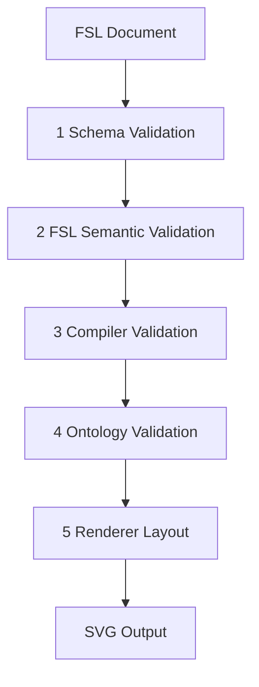

# Validation Rules

Four validation stages between FSL authoring and rendered output.

**See also:** [COMMON_ERRORS.md](./COMMON_ERRORS.md), [FSL_SPEC.md](./FSL_SPEC.md), [PROMPTING_GUIDE.md](./PROMPTING_GUIDE.md)

---

## Overview



| Stage | Component | Raises | Checked by API |
|-------|-----------|--------|--------------|
| 1 Schema | Pydantic `Figure` model | `FSLSchemaError` | `validate_fsl()`, `parse()` |
| 2 Semantic | `FSLValidator` | `FSLValidationError` | `validate_fsl()`, `parse()` |
| 3 Compiler | `CompilerValidator` | `CompilationValidationError` | `compile()` |
| 4 Ontology | `OntologyValidator` | `OntologyValidationError` | `compile()` (via compiler) |
| 5 Renderer | `layout.py`, `svg_renderer.py` | `LayoutError`, `SVGRenderError` | `render()`, `render_svg()` |

Stages 1–2 validate **FSL**. Stages 3–4 validate **compilation**. Stage 5 validates **renderability** only.

---

## 1. Schema Validation

**When:** First parse of raw dict/YAML/JSON.

**What it checks:**

- Required fields present (`fsl_version`, `metadata`, `template`, `layout`)
- Correct types (strings, arrays, objects)
- No unknown fields (`extra="forbid"` on all models)
- Non-empty required strings (`metadata.id`, `metadata.title`, `template.ref`, `layout.type`, panel/slot IDs)

**What it does NOT check:**

- Panel count vs layout type
- Template path existence
- Slot reference integrity
- Scientific correctness

### Example failure

```yaml
metadata:
  title: "Missing ID"
# missing metadata.id
```

**Error:** `metadata.id: Field required`

### Recovery

Add all required fields per [FIELD_REFERENCE.md](./FIELD_REFERENCE.md).

---

## 2. FSL Semantic Validation

**When:** After schema validation, if `run_semantic_validation=True` (default in `parse()`).

**Source:** `src/figure_agent/fsl/validator.py`

| Check | Rule |
|-------|------|
| FSL version | `fsl_version` in `SUPPORTED_FSL_VERSIONS` |
| Template ref | `template.ref` in `KNOWN_TEMPLATES` |
| Duplicate panel IDs | Unique within `layout.panels` |
| Duplicate slot IDs | Unique within `content_slots` |
| Layout consistency | Panel count matches `LAYOUT_PANEL_RULES` |
| Panel object refs | Each `object_refs` value exists in `content_slots` |

**What it does NOT check:**

- Orphan slots (compiler check)
- Style path existence
- Rules/validation path existence

### Example failure

```yaml
layout:
  type: "single-panel"
  panels:
    - id: "panel-a"
      object_refs: ["missing"]
content_slots:
  - id: "slot-1"
    type: "placeholder"
```

**Error:** `panel 'panel-a' references unknown object 'missing'`

### Recovery

Align `object_refs` with `content_slots[].id`. See [COMMON_ERRORS.md](./COMMON_ERRORS.md).

---

## 3. Compiler Validation

**When:** During `compile_figure()` / `compile()`.

**Source:** `src/figure_agent/compiler/validator.py`

| Check | Rule |
|-------|------|
| All panels mapped | Every panel has ontology entity |
| All slots mapped | Every slot has ontology entity |
| Panel references | `object_refs` resolve to mapped slots |
| Orphan slots | Every slot referenced by at least one panel |
| Duplicate ontology IDs | No ID collisions in generated registry |

### Example failure — orphan slot

```yaml
content_slots:
  - id: "slot-1"
    type: "placeholder"
  - id: "slot-orphan"
    type: "placeholder"
layout:
  panels:
    - id: "panel-a"
      object_refs: ["slot-1"]
```

**Error:** `content slot 'slot-orphan' is orphaned (not referenced by any panel)`

### Recovery

Add `slot-orphan` to a panel's `object_refs` or remove the slot.

### Example failure — unknown slot (bypassing semantic validation)

If semantic validation is skipped, compiler still catches bad refs:

**Error:** `panel 'panel-a' references unknown content slot 'missing-slot'`

---

## 4. Ontology Validation

**When:** After graph assembly in compiler.

**Source:** `src/figure_agent/ontology/validator.py`

| Check | Rule |
|-------|------|
| Duplicate entity IDs | Unique entity `id` values |
| Duplicate relationship IDs | Unique relationship `id` values |
| Valid relationship types | Type in `RelationshipType` enum |
| Missing references | `source_id` and `target_id` exist |
| Cycles | No cycles in hierarchical relationships (`contains`, `located_in`) |

### Example failure (hand-edited ontology — not from valid FSL)

**Error:** `relationship 'rel-1' references unknown target entity 'ghost'`

Valid FSL compilation should always pass ontology validation. Failure here indicates compiler bugs or manual graph editing.

---

## 5. Renderer Validation

**When:** `render()` / `render_svg()`.

**Source:** `src/figure_agent/renderers/`

| Check | Behavior |
|-------|----------|
| Graph structure | Must contain figure root and layout-resolvable entities |
| Layout computation | Panels and children positioned without overlap errors |
| SVG generation | XML produced without exception |

**What it does NOT check:**

- FSL validity (assumes prior compile)
- Style compliance
- Scientific accuracy
- Export DPI or format constraints

### Example failure

Empty ontology graph or corrupt entity data may raise `LayoutError` or `SVGRenderError`.

### Recovery

Re-compile from valid FSL. Do not patch SVG by editing FSL retroactively.

---

## Validation API Usage

```python
from figure_agent import validate_fsl, compile, render_svg

# Stage 1 + 2
result = validate_fsl(document)
if not result.valid:
    print(result.errors)

# Stage 3 + 4
compiled = compile(document)
if not compiled.success:
    print(compiled.errors)

# Stage 5
rendered = render_svg(compiled.graph)
if not rendered.success:
    print(rendered.errors)
```

---

## validation.refs vs Validator

FSL field `validation.refs` points to `validation/pre-export-checklist.md` — a **declaration** for future export validation. It does **not** trigger checks in v0.7.

Do not confuse:

- `validation.refs` in FSL (future export checklist)
- `validate_fsl()` API function (runs schema + semantic)

---

## Checklist for LLMs Before Submitting FSL

- [ ] `fsl_version: "0.3.0"`
- [ ] `metadata.id` and `metadata.title` set
- [ ] `template.ref` in known templates list
- [ ] `layout.type` in known layout types
- [ ] Panel count matches layout rules
- [ ] No duplicate panel or slot IDs
- [ ] Every `object_refs` entry matches a slot ID
- [ ] Every slot appears in at least one `object_refs`
- [ ] No ontology entities or relationships in FSL
- [ ] Run `validate_fsl()` — then `compile()` if valid

---

## Related

- [COMMON_ERRORS.md](./COMMON_ERRORS.md) — error messages and fixes
- [PROMPTING_GUIDE.md](./PROMPTING_GUIDE.md) — recovery strategy
- [EXAMPLES.md](./EXAMPLES.md) — documents that pass all stages